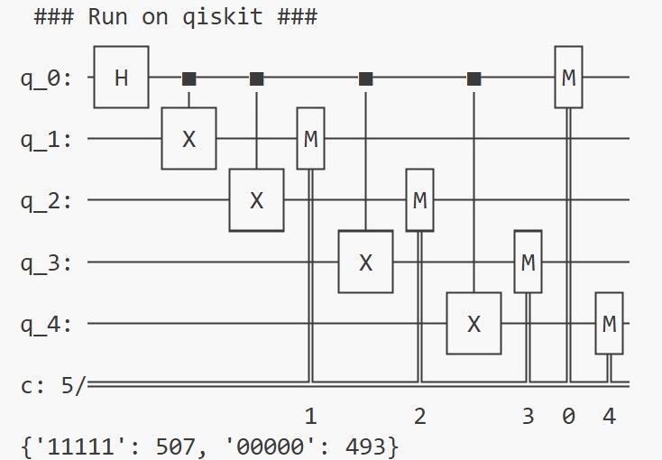
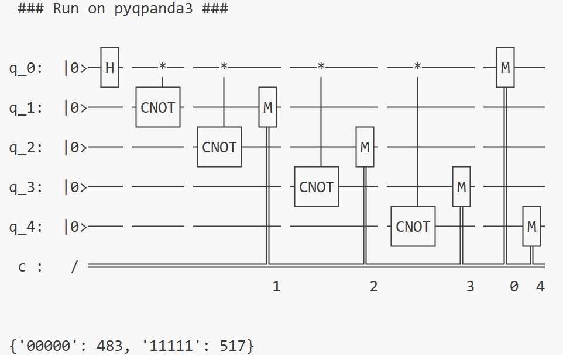
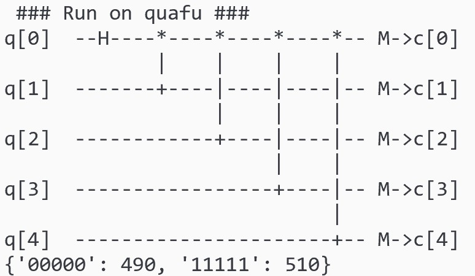
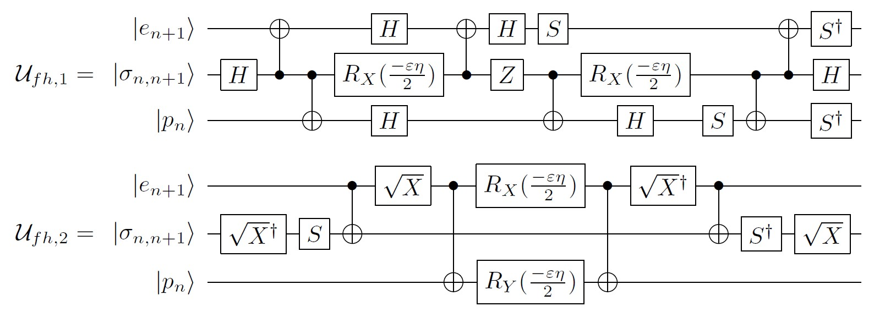

# PyQuantumKit简介

PyQuantumKit是一个基于Python的量子软件开发辅助工具，设计目标包括：

- 提供统一的方式在不同的基于Python的量子软件栈上构建量子线路，实现代码复用；
- 提供常用的量子算法和开发辅助功能，提升量子软件开发效率和正确性；
- 软件架构具有扩展性，未来可方便地添加更多的功能和量子软件栈的支持。

## 一、安装说明

PyQuantumKit无法单独使用，需要与至少一个受支持的量子软件栈联合使用，请确保您已安装需要使用的量子软件栈。

**注意：**在Python代码中，**`import pyquantumkit`需放置在对量子软件栈的导入之后**，以确保PyQuantumKit能识别已导入的量子软件栈模块。

## 二、使用示例

这里以一个简单的示例来说明如何利用PyQuantumKit在不同的量子软件栈构建量子线路，本例是`./examples/ghz_state.py`。

需求：构造一个生成GHZ状态的量子线路，运行1000次并获得测量的统计结果。编写一次代码，分别使用qiskit、pyqpanda3和quafu三个量子软件栈的模拟器运行。

#### 1. 导入需要的量子软件栈和PyQuantumKit

**请注意pyquantumkit需在量子软件栈之后导入**

```python
# import quantum software stacks
import pyqpanda3.core as qpanda
import qiskit, qiskit_aer
import quafu
# import PyQuantumKit
import pyquantumkit as PQK
```

#### 2. 利用PyQuantumKit提供的函数编写线路

```python
def ghz_state(circuit, nqbits : int):
    PQK.apply_gate(circuit, 'H', [0])               # Apply H gate on qubit with index 0
    for i in range(1, nqbits):
        PQK.apply_gate(circuit, 'cnot', [0, i])     # Apply CNOT gate on qubit with index 0 and i
    # Measure all qubits
    PQK.apply_measure(circuit, range(nqbits), range(nqbits))
```

#### 3. 设定运行参数
这里使用5个qubit，运行轮数为1000

```python
# The number of qubits
Nqs = 5
# The number of running shots
Nshots = 1000
```

#### 4. 在qiskit上运行

```python
print(' ### Run on qiskit ### ')

qiskit_circuit = qiskit.QuantumCircuit(Nqs, Nqs)
ghz_state(qiskit_circuit, Nqs)    # unified quantum circuit construction
print(qiskit_circuit)             # print quantum circuit

qiskit_qvm = qiskit_aer.Aer.get_backend('aer_simulator')
qiskit_job = qiskit_qvm.run(qiskit_circuit, shots = Nshots)
qiskit_result = qiskit_job.result().get_counts()
print(qiskit_result)        # print running results
```

运行结果为：


#### 5. 在pyqpanda3上运行

```python
print(' ### Run on pyqpanda3 ### ')

qpanda_circuit = qpanda.QProg(Nqs)
ghz_state(qpanda_circuit, Nqs)    # unified quantum circuit construction
print(qpanda_circuit)             # print quantum circuit

qpanda_qvm = qpanda.CPUQVM()
qpanda_qvm.run(qpanda_circuit, Nshots)
qpanda_result = qpanda_qvm.result().get_counts()
print(qpanda_result)        # print running results
```

运行结果为：


#### 6. 在quafu上运行

```python
print(' ### Run on quafu ### ')

quafu_circuit = quafu.QuantumCircuit(Nqs, Nqs)
ghz_state(quafu_circuit, Nqs)    # unified quantum circuit construction
quafu_circuit.draw_circuit()     # print quantum circuit

quafu_result = quafu.simulate(quafu_circuit, shots = Nshots)
print(quafu_result.counts)    # print running results
```

运行结果为：


#### 7. 更多的例子可在`./examples`文件夹下找到。

## 三、功能简介

基于v.0.1.4版本

### 3.1 当前支持的量子软件栈

PyQuantumKit采用“代码翻译”的方式实现对多个量子软件栈的支持，通过识别函数参数中的量子线路的类型及其所属的量子软件栈，将该函数调用翻译为对应量子软件栈的调用代码。当前支持的量子软件栈如下：

- qiskit
- pyqpanda3
- quafu（仅支持量子线路构建）

### 3.2 apply_gate函数简介

以统一的方式构建量子线路的关键是`apply_gate`函数，该函数的原型为：

```python
def apply_gate(q_circuit, gate_str : str, qbits : list[int], paras : list = None)
```

- 参数`q_circuit`指定目标量子线路，它的类型是各量子软件栈的量子线路类（例如qiskit的`QuantumCircuit`，或pyqpanda3的`QCircuit`或`QProg`）。函数将根据此参数所属的量子软件栈，将对量子门的应用翻译为对应量子软件栈的代码。
- 参数`gate_str`是一个字符串，用于指示需要应用的门。考虑到同一个门可能有多个不同的名称（例如Toffoli,CCNOT,CCX都表示同一个门），PyQuantumKit允许以不同的名字字符串来表示同一个门，且不区分大小写。具体支持的字符串见本节后面的说明。
- 参数`qbits`是一个整数列表，指定门要应用的量子比特下标。注意无论量子门是单比特还是多比特，都需要以列表的方式指派此参数。
- 参数`paras`是一个列表，用于为含参数门指派参数，参见本节后面“含参数门”部分；对于无参数门，不用指派此参数。


#### 单比特门

- I门：i, id
- X门：x
- Y门：y
- Z门：z
- S门：s
- T门：t
- H门：h
- $S^{\dagger}$ 门：sd, sdg, sdag, sdagger
- $T^{\dagger}$ 门：td, tdg, tdag, tdagger
- $\sqrt{X}$ 门：sx, sqrtx
- $\sqrt{X}^{\dagger}$ 门：sxd, sxdg, sxdag, sxdagger, sqrtxd, sqrtxdg, sqrtxdag, sqrtxdagger

例：在下标为2的量子位上应用一个S门
`apply_gate(circuit, 'S', [2])`

#### 多比特门

- CNOT门：cnot, cx
- CZ门：cz
- CY门：cy
- CH门：ch
- CS门：cs
- $CS^{\dagger}$ 门：csd, csdg, csdag, csdagger
- SWAP门：swap, sw
- iSWAP门：iswap, isw
- Toffoli门：toffoli, ccx, ccnot
- Fredkin门：fredkin, cswap, csw

例：对下标为0、2和3的量子位应用Toffoli门
`apply_gate(circuit, 'CCNOT', [0, 2, 3])`

#### 含参数门

- $R_x(\theta)$ 门：rx
- $R_y(\theta)$ 门：ry
- $R_z(\theta)$ 门：rz
- $U_1(\theta)$ 门：u1, r1, p
- 受控 $R_x(\theta)$ 门：crx
- 受控 $R_y(\theta)$ 门：cry
- 受控 $R_z(\theta)$ 门：crz
- 受控 $U_1(\theta)$ 门：cu1, cr1, cp
- $R_{xx}(\theta)$ 门：rxx
- $R_{yy}(\theta)$ 门：ryy
- $R_{zz}(\theta)$ 门：rzz
- $U_3(\theta,\phi,\lambda)$ 门：u3, u

含参数门需要使用`apply_gate`函数的第四个参数来指派参数。

例：对下标为1的量子位应用 $R_x$ 门，参数 $\theta=0.1$
`apply_gate(circuit, 'Rx', [1], [0.1])`

例：对下标为0的量子位应用 $U_3$ 门，参数 $\theta=0.2,\phi=0.3,\lambda=0.4$
`apply_gate(circuit, 'U3', [0], [0.2, 0.3, 0.4])`

### 3.3 apply_measure函数简介

`apply_measure`函数测量目标量子比特，函数原型为：

```python
def apply_measure(q_circuit, qindex : list[int], cindex : list[int])
```

- 参数`q_circuit`指定目标量子线路。
- 参数`qindex`是一个整数列表，指定要测量的量子比特下标。
- 参数`cindex`是一个整数列表，指定测量结果存放的经典比特下标。`qindex`和`cindex`各分量分别对应，因此`qindex`和`cindex`长度应相同。


### 3.4 量子哈密顿量模拟算法简介和例子

PyquantumKit提供了一个量子哈密顿量模拟的算法库，可用于构建量子哈密顿量模拟程序。量子哈密顿量模拟算法即实现变换： $U=e^{-iHt}$ ，其中 $H$ 为代表量子系统哈密顿量的厄密矩阵， $t$ 为设定的演化时间。

PyQuantumKit目前支持以Pauli算子的线性组合形式表示哈密顿量：

$$H=\sum_{i_1,i_2,\dots,i_n\in\{0,1,2,3\}} k_{i_1,i_2,\dots i_n} \sigma_{i_1}\otimes\sigma_{i_2}\otimes \dots \otimes\sigma_{i_n}$$

每一项对应一个 $n$ 比特Pauli算子，它是单比特Pauli算子的张量积， $k_{i_1,i_2,\dots i_n} \in \mathbb{R}$ 为该Pauli算子对应的线性组合系数，求和至多 $4^n$ 项。有4个单比特Pauli算子：

$$\sigma_0 = \left[\begin{array}{cc}1&0\\0&1\end{array}\right], \sigma_1 = \left[\begin{array}{cc}0&1\\1&0\end{array}\right], \sigma_2 = \left[\begin{array}{cc}0&-i\\i&0\end{array}\right], \sigma_3 = \left[\begin{array}{cc}1&0\\0&-1\end{array}\right]$$

实际的哈密顿量往往具有稀疏性，即 $4^n$ 个组合系数中只有 $O(n)$ 个不为0，因此对哈密顿量的模拟可以分解为对各Pauli矩阵形式的模拟的组合。

设总哈密顿量可以写成 $m$ 个局部哈密顿量之和 $H=H_1+H_2+\dots+H_m$ ，若这 $m$ 个局部哈密顿量两两对易（即乘法可交换： $\forall i\neq j, H_iH_j=H_jH_i$ ），则对总哈密顿量的模拟可以严格分解为对各局部哈密顿量的依次模拟：

$$ e^{-i(H_1+H_2+\dots+H_m)t} = e^{-iH_1t}e^{-iH_2t} \dots e^{-iH_mt} $$

然而在实际中，各局部哈密顿量往往不具有对易性质，因此需要使用一定的近似公式来进行模拟。有两种常用的近似方式：Lie-Trotter和2阶Suzuki，它们分别可以近似到时间步长 $\Delta t$ 的平方和三次方。
Lie-Trotter公式：
$$e^{-i(H_1+H_2+\dots+H_m)\Delta t} = e^{-iH_1 \Delta t}e^{-iH_2 \Delta t} \dots e^{-iH_m \Delta t} + O(\Delta t^2)$$

2阶Suzuki公式：
$$e^{-i(H_1+H_2+\dots+H_m)\Delta t} = e^{-iH_1 \Delta t/2}e^{-iH_2 \Delta t/2} \dots e^{-iH_m \Delta t/2}e^{-iH_m \Delta t/2}e^{-iH_{m-1} \Delta t/2} \dots e^{-iH_1 \Delta t/2} + O(\Delta t^3)$$

因此在实践中，可以选定一个重复次数 $n$ ，并取时间步长 $\Delta t=t/n$ ，于是总的哈密顿量模拟可以分解为 $n$ 次重复：
$$e^{-i(H_1+H_2+\dots+H_m)t} \sim \left( e^{-iH_1 t/n}e^{-iH_2 t/n} \dots e^{-iH_m t/n} \right)^n$$

$$e^{-i(H_1+H_2+\dots+H_m)t} \sim \left( e^{-iH_1 t/2n}e^{-iH_2 t/2n} \dots e^{-iH_m t/2n}e^{-iH_m t/2n}e^{-iH_{m-1} t/2n} \dots e^{-iH_1 t/2n} \right)^n$$

PyQuantumKit提供了基于上述两种分解方式的量子哈密顿量模拟算法，函数原型为：

```python
def pqk_hsim_paulis_trotter(q_circuit, hamiltonian : PauliHamiltonian, t : float, n : int, qindex : list[int]):
def pqk_hsim_paulis_suzuki2(q_circuit, hamiltonian : PauliHamiltonian, t : float, n : int, qindex : list[int]):
```

- 参数`q_circuit`指定目标量子线路。
- 参数`hamiltonian`是一个`PauliHamiltonian`类，用于指定目标哈密顿量 $H$ ；
- 参数`t`指定演化时间；
- 参数`n`指定分解的重复次数；
- 参数`qindex`是一个整数列表，指定要应用哈密顿模拟的量子比特下标。

函数中使用了`PauliHamiltonian`类来表示哈密顿量，成员函数`append_pauli`用于在`PauliHamiltonian`类中添加一个哈密顿量的Pauli因子，原型为：

```python
class PauliHamiltonian:
    def append_pauli(self, paulistr : str, factor : float, focus : int = 0) -> None:
```

- 参数`paulistr`是一个由'I','X','Y','Z'组成的字符串，用于指定对应的Pauli算子，字符串长度应与`PauliHamiltonian`对象构造时指定的量子比特数目匹配。
- 参数`factor`是一个浮点数，指定该因子的系数；
- 参数`focus`是一个可选参数，用于控制量子线路生成的方式，默认为0。

以下示例展示了如何使用PyQuantumKit构造量子哈密顿量模拟线路。考虑横场伊辛模型，每个粒子用一个量子比特表示，哈密顿量为：
$$H=-J\sum_{<i,j>}\sigma_3^{(i)}\sigma_3^{(j)} - B\sum_{i}\sigma_1^{(i)} $$

其中 $\sigma_3^{(i)}\sigma_3^{(j)}$ 表示在第 $i,j$ 个量子比特上的Pauli算子为 $\sigma_3$ ，其余量子比特上为 $\sigma_0$ ； $\sigma_1^{(i)}$ 表示在第 $i$ 个量子比特上的Pauli算子为 $\sigma_1$ ，其余量子比特上为 $\sigma_0$ 。求和下标 <i,j> 表示对近邻粒子求和。

这里我们考虑一个具体的案例。一共 $N=5$ 个粒子，排成环状，在环上相邻的粒子之间有相互作用。设定相互作用强度 $J=1.0$ ，外加磁场的强度 $B=1.0$ ，演化时间 $t=1.0$ 。采用Lie-Trotter分解方案，重复次数设为 $n=20$ 次。利用PyQuantumKit在QPanda3和Qiskit上构建量子线路的代码（详见`./examples/tf_ising.py`）如下：

```python
import pyqpanda3.core as qpanda
import qiskit, qiskit_aer
import pyquantumkit as PQK
import pyquantumkit.library.hamiltonian as PQKHami

N = 5           # number of particles
J = 1.0         # interaction
B = 1.0         # magnatic field
t = 1.0         # evolution time
n = 20          # rounds of decomposition

# ----- Build the Hamiltonian -----
# construct a PauliHamiltonian object, the parameter is the number of qubits
TFIsing = PQKHami.PauliHamiltonian(N)
# interaction terms
TFIsing.append_pauli('ZZIII', -J)
TFIsing.append_pauli('IZZII', -J)
TFIsing.append_pauli('IIZZI', -J)
TFIsing.append_pauli('IIIZZ', -J)
TFIsing.append_pauli('ZIIIZ', -J)
# magnatic field terms
TFIsing.append_pauli('XIIII', -B)
TFIsing.append_pauli('IXIII', -B)
TFIsing.append_pauli('IIXII', -B)
TFIsing.append_pauli('IIIXI', -B)
TFIsing.append_pauli('IIIIX', -B)

# construct circuit on qpanda
qpanda_circuit = qpanda.QCircuit(N)
PQKHami.pqk_hsim_paulis_trotter(qpanda_circuit, TFIsing, t, n, range(N))
print(qpanda_circuit)

# construct circuit on qiskit
qiskit_circuit = qiskit.QuantumCircuit(N)
PQKHami.pqk_hsim_paulis_trotter(qiskit_circuit, TFIsing, t, n, range(N))
print(qiskit_circuit)
```

### 3.5 量子线路的矩阵符号表示

PyQuantumKit提供了symbol库 (/symbol) ，此模块基于sympy库实现，用于构造量子线路的矩阵表示。hiquarc仓库中还有另一个基于Mathematica的构造量子线路的矩阵表示库QCirMat（见[https://github.com/hiquarc/QCirMat](https://github.com/hiquarc/QCirMat)），此symbol库可以视为基于Python和sympy版本的QCirMat，方便没有Mathematica的用户使用。

`/symbol/gate.py`模块提供了基本门的矩阵表示（基于`sympy.Matrix`类），`/symbol/qstate.py`模块提供了基本量子态向量表示（包括ket表示、bra表示和密度矩阵表示）。
`/symbol/circuit.py`模块提供了若干用于构造量子线路的矩阵表示的函数。

**注意：由于Python对于下标的约定是从0开始，symbol库涉及下标的参数均按照Python的约定从0开始，这与Mathematica的从1开始的约定不同。**

#### symbol_apply_gate函数

`symbol_apply_gate`函数在指定下标的量子比特上应用指定的量子门，返回对应的矩阵表示。函数原型为：

```python
def symbol_apply_gate(gate : sympy.Matrix, nqbits : int, indexlist : list[int]) -> sympy.Matrix:
```

- 参数`gate`是一个 $2^k\times 2^k$ 矩阵，其中 $k$ 代表了量子门的比特数，例如单比特量子门（ $k=1$ ）是 $2\times 2$ 矩阵，双比特量子门（ $k=2$ ）是 $4\times 4$ 矩阵。
- 参数`nqbits`是一个正整数，指定总量子比特数 $n$ ，该参数不能小于 $k$ 。
- 参数`indexlist`是一个列表，按顺序指定要作用量子门的比特的下标，**注意下标从0开始，这与基于Mathematica的QCirMat不同**。列表长度必须为 $k$ ，即与参数`gate`的维数匹配。
- 该函数的返回值为一个 $2^n\times 2^n$ 维矩阵。

例：设总共有5个量子比特，以下标为3的量子比特为控制位，下标为1的量子比特为目标位应用一个CNOT门。可用如下方式调用：

```python
from pyquantumkit.symbol.gate import *
from pyquantumkit.symbol.circuit import *

Mat1 = symbol_apply_gate(CNOT, 5, [3, 1])
print(Mat1)
```

返回结果为一个 $32\times 32$（即 $2^5\times 2^5$）维矩阵。

```
Matrix([[1, 0, 0, 0, 0, 0, 0, 0, 0, 0, 0, 0, 0, 0, 0, 0, 0, 0, 0, 0, 0, 0, 0, 0, 0, 0, 0, 0, 0, 0, 0, 0], [0, 1, 0, 0, 0, 0, 0, 0, 0, 0, 0, 0, 0, 0, 0, 0, 0, 0, 0, 0, 0, 0, 0, 0, 0, 0, 0, 0, 0, 0, 0, 0], [0, 0, 0, 0, 0, 0, 0, 0, 0, 0, 1, 0, 0, 0, 0, 0, 0, 0, 0, 0, 0, 0, 0, 0, 0, 0, 0, 0, 0, 0, 0, 0], [0, 0, 0, 0, 0, 0, 0, 0, 0, 0, 0, 1, 0, 0, 0, 0, 0, 0, 0, 0, 0, 0, 0, 0, 0, 0, 0, 0, 0, 0, 0, 0], [0, 0, 0, 0, 1, 0, 0, 0, 0, 0, 0, 0, 0, 0, 0, 0, 0, 0, 0, 0, 0, 0, 0, 0, 0, 0, 0, 0, 0, 0, 0, 0], [0, 0, 0, 0, 0, 1, 0, 0, 0, 0, 0, 0, 0, 0, 0, 0, 0, 0, 0, 0, 0, 0, 0, 0, 0, 0, 0, 0, 0, 0, 0, 0], [0, 0, 0, 0, 0, 0, 0, 0, 0, 0, 0, 0, 0, 0, 1, 0, 0, 0, 0, 0, 0, 0, 0, 0, 0, 0, 0, 0, 0, 0, 0, 0], [0, 0, 0, 0, 0, 0, 0, 0, 0, 0, 0, 0, 0, 0, 0, 1, 0, 0, 0, 0, 0, 0, 0, 0, 0, 0, 0, 0, 0, 0, 0, 0], [0, 0, 0, 0, 0, 0, 0, 0, 1, 0, 0, 0, 0, 0, 0, 0, 0, 0, 0, 0, 0, 0, 0, 0, 0, 0, 0, 0, 0, 0, 0, 0], [0, 0, 0, 0, 0, 0, 0, 0, 0, 1, 0, 0, 0, 0, 0, 0, 0, 0, 0, 0, 0, 0, 0, 0, 0, 0, 0, 0, 0, 0, 0, 0], [0, 0, 1, 0, 0, 0, 0, 0, 0, 0, 0, 0, 0, 0, 0, 0, 0, 0, 0, 0, 0, 0, 0, 0, 0, 0, 0, 0, 0, 0, 0, 0], [0, 0, 0, 1, 0, 0, 0, 0, 0, 0, 0, 0, 0, 0, 0, 0, 0, 0, 0, 0, 0, 0, 0, 0, 0, 0, 0, 0, 0, 0, 0, 0], [0, 0, 0, 0, 0, 0, 0, 0, 0, 0, 0, 0, 1, 0, 0, 0, 0, 0, 0, 0, 0, 0, 0, 0, 0, 0, 0, 0, 0, 0, 0, 0], [0, 0, 0, 0, 0, 0, 0, 0, 0, 0, 0, 0, 0, 1, 0, 0, 0, 0, 0, 0, 0, 0, 0, 0, 0, 0, 0, 0, 0, 0, 0, 0], [0, 0, 0, 0, 0, 0, 1, 0, 0, 0, 0, 0, 0, 0, 0, 0, 0, 0, 0, 0, 0, 0, 0, 0, 0, 0, 0, 0, 0, 0, 0, 0], [0, 0, 0, 0, 0, 0, 0, 1, 0, 0, 0, 0, 0, 0, 0, 0, 0, 0, 0, 0, 0, 0, 0, 0, 0, 0, 0, 0, 0, 0, 0, 0], [0, 0, 0, 0, 0, 0, 0, 0, 0, 0, 0, 0, 0, 0, 0, 0, 1, 0, 0, 0, 0, 0, 0, 0, 0, 0, 0, 0, 0, 0, 0, 0], [0, 0, 0, 0, 0, 0, 0, 0, 0, 0, 0, 0, 0, 0, 0, 0, 0, 1, 0, 0, 0, 0, 0, 0, 0, 0, 0, 0, 0, 0, 0, 0], [0, 0, 0, 0, 0, 0, 0, 0, 0, 0, 0, 0, 0, 0, 0, 0, 0, 0, 0, 0, 0, 0, 0, 0, 0, 0, 1, 0, 0, 0, 0, 0], [0, 0, 0, 0, 0, 0, 0, 0, 0, 0, 0, 0, 0, 0, 0, 0, 0, 0, 0, 0, 0, 0, 0, 0, 0, 0, 0, 1, 0, 0, 0, 0], [0, 0, 0, 0, 0, 0, 0, 0, 0, 0, 0, 0, 0, 0, 0, 0, 0, 0, 0, 0, 1, 0, 0, 0, 0, 0, 0, 0, 0, 0, 0, 0], [0, 0, 0, 0, 0, 0, 0, 0, 0, 0, 0, 0, 0, 0, 0, 0, 0, 0, 0, 0, 0, 1, 0, 0, 0, 0, 0, 0, 0, 0, 0, 0], [0, 0, 0, 0, 0, 0, 0, 0, 0, 0, 0, 0, 0, 0, 0, 0, 0, 0, 0, 0, 0, 0, 0, 0, 0, 0, 0, 0, 0, 0, 1, 0], [0, 0, 0, 0, 0, 0, 0, 0, 0, 0, 0, 0, 0, 0, 0, 0, 0, 0, 0, 0, 0, 0, 0, 0, 0, 0, 0, 0, 0, 0, 0, 1], [0, 0, 0, 0, 0, 0, 0, 0, 0, 0, 0, 0, 0, 0, 0, 0, 0, 0, 0, 0, 0, 0, 0, 0, 1, 0, 0, 0, 0, 0, 0, 0], [0, 0, 0, 0, 0, 0, 0, 0, 0, 0, 0, 0, 0, 0, 0, 0, 0, 0, 0, 0, 0, 0, 0, 0, 0, 1, 0, 0, 0, 0, 0, 0], [0, 0, 0, 0, 0, 0, 0, 0, 0, 0, 0, 0, 0, 0, 0, 0, 0, 0, 1, 0, 0, 0, 0, 0, 0, 0, 0, 0, 0, 0, 0, 0], [0, 0, 0, 0, 0, 0, 0, 0, 0, 0, 0, 0, 0, 0, 0, 0, 0, 0, 0, 1, 0, 0, 0, 0, 0, 0, 0, 0, 0, 0, 0, 0], [0, 0, 0, 0, 0, 0, 0, 0, 0, 0, 0, 0, 0, 0, 0, 0, 0, 0, 0, 0, 0, 0, 0, 0, 0, 0, 0, 0, 1, 0, 0, 0], [0, 0, 0, 0, 0, 0, 0, 0, 0, 0, 0, 0, 0, 0, 0, 0, 0, 0, 0, 0, 0, 0, 0, 0, 0, 0, 0, 0, 0, 1, 0, 0], [0, 0, 0, 0, 0, 0, 0, 0, 0, 0, 0, 0, 0, 0, 0, 0, 0, 0, 0, 0, 0, 0, 1, 0, 0, 0, 0, 0, 0, 0, 0, 0], [0, 0, 0, 0, 0, 0, 0, 0, 0, 0, 0, 0, 0, 0, 0, 0, 0, 0, 0, 0, 0, 0, 0, 1, 0, 0, 0, 0, 0, 0, 0, 0]])
```

#### symbol_controlled_gate函数

`symbol_controlled_gate`函数返回一个指定量子门的受控形式的矩阵表示。函数原型为：

```python
def symbol_controlled_gate(gate : sympy.Matrix, nctrlbits : int) -> sympy.BlockDiagMatrix:
```

- 参数`gate`是一个 $2^k\times 2^k$ 矩阵，其中 $k$ 代表了量子门的比特数。
- 参数`nctrlbits`是一个正整数，指定控制量子比特个数 $n$ 。
- 该函数的返回值为一个 $2^{n+k}\times 2^{n+k}$ 维分块对角矩阵（`sympy.BlockDiagMatrix`类对象），其中对应的前 $n$ 个量子比特为控制位， 后 $k$ 个量子比特为目标位。

联合使用`symbol_controlled_gate`和`symbol_apply_gate`函数，可以生成以其中一些量子比特为控制位，其他一些量子比特为目标位的受控门的矩阵表示。

#### symbol_multi_apply_sqgate函数

`symbol_multi_apply_sqgate`函数生成在每个量子比特上分别应用一个单比特量子门的矩阵表示，即给定 $2\times 2$ 矩阵 $U$ 和总量子比特数 $n$ ，函数生成矩阵 $U^{\otimes n}$ 。函数原型为：

```python
def symbol_multi_apply_sqgate(sqgate : sympy.Matrix, nqbits : int) -> sympy.Matrix:
```

- 参数`sqgate`是个一个 $2\times 2$ 矩阵，表示单比特量子门。
- 参数`nqbits`是一个正整数，表示总量子比特数 $n$ 。
- 函数返回一个 $2^n\times 2^n$ 维矩阵。

`symbol_multi_apply_sqgate(U, 2)`等价于`sympy.KroneckerProduct(U, U)`；
`symbol_multi_apply_sqgate(U, 3)`等价于`sympy.KroneckerProduct(U, U, U)`。

### 3.6 CircuitIO类简介

PyQuantumKit提供了一个`CircuitIO`类，用于暂存构建的量子线路以及控制格式化输入输出。

`CircuitIO`类可以像一个量子软件栈的量子线路类一样使用，也可以对其执行`apply_gate`, `apply_measure`等操作。`CircuitIO`对象保存了量子线路的信息，随后可以格式化输出为字符串或插入具体的量子软件栈的量子线路对象中。

```python
cio = PQK.CircuitIO(2, 2)        # define a CircuitIO object
PQK.apply_gate(cio, 'H', [0])    # Use generic function <gate_apply>
cio.apply_gate('CX', [0, 1])     # Use CircuitIO member function <gate_apply>
```

由于某些量子软件栈不支持自动生成逆线路和量子比特的重映射，可以利用`CircuitIO`类间接完成构造：先在`CircuitIO`对象上构造线路并生成逆线路或重映射（使用`inverse`和`remap_qbits`、`remap_cbits`成员函数），然后利用`>>`运算符（或等价的，`append_into_actual_circuit`成员函数）将CircuitIO包含的量子线路插入到具体量子软件栈的量子线路中。

```python
# quafu framework does not support qubits remap and circuit auto-inverse
# Here we use CircuitIO object to implement indirectly
cio.inverse()              # inverse the circuit in CircuitIO object cio
cio.remap_qbits([1, 0])    # remap the circuit in cio
quafu_circuit = quafu.QuantumCircuit(2, 2)
cio >> quafu_circuit       # insert the CircuitIO object cio into quafu's circuit
```

#### CircuitIO类与符号表示

`CircuitIO`类对象支持以sympy符号作为含参量子门（例如Rx门）的参数，并可根据对象内已包含的量子门序列计算出整个量子线路的矩阵表示。

利用`get_sympy_matrix`成员函数可以计算`CircuitIO`对象的量子线路的矩阵表示，函数原型为：

```python
def get_sympy_matrix(self, subsdict : dict = None, simplify : bool = True) -> sympy.Matrix:
```

- 可选参数`subsdict`是一个字典，用于指定sympy符号代入规则。默认为None，即不进行任何符号代换。**注：只有当使用了sympy符号作为量子门参数时才需要指定此参数。**
- 可选参数`simplify`指定是否在计算矩阵表示的过程中进行化简（即sympy的simplify操作），默认为True。
- 函数返回量子线路对应的矩阵表示。

在将`CircuitIO`对象的量子线路转换为具体量子软件栈的量子线路对象时，可以将具体的数值代入这些sympy符号中。`append_into_actual_circuit`成员函数有一个额外可选参数`subsdict`，用于指定sympy符号代入规则。**注：当需要在插入到具体的量子软件栈的量子线路的过程中进行符号代入时，不能使用`>>`运算符，必须显式使用`append_into_actual_circuit`成员函数。**

```python
def append_into_actual_circuit(self, dest_qcir, subsdict : dict = None):
```

#### CircuitIO符号表示示例

这里我们考虑一个具体的案例，详见`./examples/symbol.py`。考虑来自论文

Simulating ℤ_2 lattice gauge theory on a quantum computer
https://arxiv.org/abs/2305.02361

的两个量子线路（分别记为Ufh1和Ufh2），到这两个线路包含符号变量 $\epsilon$ 和 $\eta$ 。如下图所示：



首先我们定义两个sympy符号变量，分别表示 $\epsilon$ 和 $\eta$ 。

```python
import pyqpanda3.core as qpanda
import qiskit, qiskit_aer
import quafu
import pyquantumkit as PQK
import sympy

eta_ = sympy.Symbol('eta')
epsilon_ = sympy.Symbol('epsilon')
```

接着我们分别编写构造这两个量子线路的函数，其中Rx和Ry门的参数直接赋予符号变量。

```python
def build_Ufh1(qc):
    PQK.apply_gate(qc, 'H', [1])
    PQK.apply_gate(qc, 'CNOT', [1, 0])
    PQK.apply_gate(qc, 'CNOT', [1, 2])
    PQK.apply_gate(qc, 'H', [0])
    PQK.apply_gate(qc, 'Rx', [1], [-epsilon_ * eta_ / 2])
    PQK.apply_gate(qc, 'H', [2])
    PQK.apply_gate(qc, 'CNOT', [1, 0])
    PQK.apply_gate(qc, 'H', [0])
    PQK.apply_gate(qc, 'Z', [1])
    PQK.apply_gate(qc, 'S', [0])
    PQK.apply_gate(qc, 'CNOT', [1, 2])
    PQK.apply_gate(qc, 'Rx', [1], [-epsilon_ * eta_ / 2])
    PQK.apply_gate(qc, 'H', [2])
    PQK.apply_gate(qc, 'S', [2])
    PQK.apply_gate(qc, 'CNOT', [1, 2])
    PQK.apply_gate(qc, 'CNOT', [1, 0])
    PQK.apply_gate(qc, 'Sdag', [0])
    PQK.apply_gate(qc, 'H', [1])
    PQK.apply_gate(qc, 'Sdag', [2])

def build_Ufh2(qc):
    PQK.apply_gate(qc, 'SqrtXdag', [1])
    PQK.apply_gate(qc, 'S', [1])
    PQK.apply_gate(qc, 'CNOT', [0, 1])
    PQK.apply_gate(qc, 'SqrtX', [0])
    PQK.apply_gate(qc, 'CNOT', [0, 2])
    PQK.apply_gate(qc, 'Rx', [0], [-epsilon_ * eta_ / 2])
    PQK.apply_gate(qc, 'Ry', [2], [-epsilon_ * eta_ / 2])
    PQK.apply_gate(qc, 'CNOT', [0, 2])
    PQK.apply_gate(qc, 'SqrtXdag', [0])
    PQK.apply_gate(qc, 'CNOT', [0, 1])
    PQK.apply_gate(qc, 'Sdag', [1])
    PQK.apply_gate(qc, 'SqrtX', [1])
```

然后声明两个CircuitIO对象，并在其上构造这两个量子线路。

```python
# Declare two CircuitIO objects
CIO_Ufh1 = PQK.CircuitIO(3)
CIO_Ufh2 = PQK.CircuitIO(3)
# Build circuits on CircuitIO objects
build_Ufh1(CIO_Ufh1)
build_Ufh2(CIO_Ufh2)
```

利用`get_sympy_matrix`函数计算两个量子线路的矩阵表示：

```python
mat1 = CIO_Ufh1.get_sympy_matrix()
mat2 = CIO_Ufh2.get_sympy_matrix()
print(mat1)
print(mat2)
```

输出为

```
Matrix([[1, 0, 0, 0, 0, 0, 0, 0], [0, cos(epsilon*eta/2), 0, 0, I*sin(epsilon*eta/2), 0, 0, 0], [0, 0, 1, 0, 0, 0, 0, 0], [0, 0, 0, cos(epsilon*eta/2), 0, 0, -I*sin(epsilon*eta/2), 0], [0, I*sin(epsilon*eta/2), 0, 0, cos(epsilon*eta/2), 0, 0, 0], [0, 0, 0, 0, 0, 1, 0, 0], [0, 0, 0, -I*sin(epsilon*eta/2), 0, 0, cos(epsilon*eta/2), 0], [0, 0, 0, 0, 0, 0, 0, 1]])
Matrix([[1, 0, 0, 0, 0, 0, 0, 0], [0, cos(epsilon*eta/2), 0, 0, -I*sin(epsilon*eta/2), 0, 0, 0], [0, 0, 1, 0, 0, 0, 0, 0], [0, 0, 0, cos(epsilon*eta/2), 0, 0, I*sin(epsilon*eta/2), 0], [0, -I*sin(epsilon*eta/2), 0, 0, cos(epsilon*eta/2), 0, 0, 0], [0, 0, 0, 0, 0, 1, 0, 0], [0, 0, 0, I*sin(epsilon*eta/2), 0, 0, cos(epsilon*eta/2), 0], [0, 0, 0, 0, 0, 0, 0, 1]])
```

可以对两个矩阵作差，并将差值与零矩阵比较，来比较两个量子线路的等价性：

```python
diff = sympy.simplify(mat1 - mat2)
print(diff)
```

```
Matrix([[0, 0, 0, 0, 0, 0, 0, 0], [0, 0, 0, 0, 2*I*sin(epsilon*eta/2), 0, 0, 0], [0, 0, 0, 0, 0, 0, 0, 0], [0, 0, 0, 0, 0, 0, -2*I*sin(epsilon*eta/2), 0], [0, 2*I*sin(epsilon*eta/2), 0, 0, 0, 0, 0, 0], [0, 0, 0, 0, 0, 0, 0, 0], [0, 0, 0, -2*I*sin(epsilon*eta/2), 0, 0, 0, 0], [0, 0, 0, 0, 0, 0, 0, 0]])
```

最后我们将量子线路在qiskit、pyqpanda3和quafu三个量子软件栈中实现，并为符号变量代入不同的数值。这要利用`append_into_actual_circuit`成员函数，并将指定参数`subsdict`为表示代换的字典。例如，如果要将`eta_`代入数值1，`epsilon_`代入数值0.3，则需要将参数指定为`{eta_ : 1, epsilon_ : 0.3}`。

```python
# ---------- Implement on Qiskit ----------
qiskit_circuit1 = qiskit.QuantumCircuit(3)
# Substitute the symbols: eta_ = 1, epsilon_ = 0.3
CIO_Ufh1.append_into_actual_circuit(qiskit_circuit1, {eta_ : 1, epsilon_ : 0.3})
print(qiskit_circuit1)

qiskit_circuit2 = qiskit.QuantumCircuit(3)
# Substitute the symbols: eta_ = 1, epsilon_ = 0.3
CIO_Ufh2.append_into_actual_circuit(qiskit_circuit2, {eta_ : 1, epsilon_ : 0.3})
print(qiskit_circuit2)

# ---------- Implement on QPanda3 ----------
qpanda_circuit1 = qpanda.QCircuit(3)
# Substitute the symbols: eta_ = 2, epsilon_ = 0.2
CIO_Ufh1.append_into_actual_circuit(qpanda_circuit1, {eta_ : 2, epsilon_ : 0.2})
print(qpanda_circuit1)

qpanda_circuit2 = qpanda.QCircuit(3)
# Substitute the symbols: eta_ = 2, epsilon_ = 0.2
CIO_Ufh2.append_into_actual_circuit(qpanda_circuit2, {eta_ : 2, epsilon_ : 0.2})
print(qpanda_circuit2)

# ---------- Implement on Quafu ----------
quafu_circuit1 = quafu.QuantumCircuit(3)
# Substitute the symbols: eta_ = 3, epsilon_ = 0.12
CIO_Ufh1.append_into_actual_circuit(quafu_circuit1, {eta_ : 3, epsilon_ : 0.12})
quafu_circuit1.draw_circuit()

quafu_circuit2 = quafu.QuantumCircuit(3)
# Substitute the symbols: eta_ = 3, epsilon_ = 0.12
CIO_Ufh2.append_into_actual_circuit(quafu_circuit2, {eta_ : 3, epsilon_ : 0.12})
quafu_circuit2.draw_circuit()
```

### 一些尚处于实验阶段的功能

这些功能尚处于实验阶段，未经过系统性的测试，且接口在未来可能改变，请谨慎使用。

#### 模块化量子线路构建

量子线路/程序的新建、复制、串联、并联： `new_circuit`, `new_program`, `copy_circuit`, `copy_program`, `append_circuit`, `append_program`, `parallel_circuits`, `parallel_programs`

获取量子线路的经典比特/量子比特数目： `get_n_qubits`, `get_n_cbits`, `get_qubit_list`, `get_cbit_list`

生成量子线路的逆版本或重排量子比特的版本： `derivative`

Pauli测量： `apply_measure_x`, `apply_measure_y`, `apply_measure_z`, `apply_pauli_measure`

以统一的方式运行量子线路： `run_and_get_counts`

#### classical/run_result模块：运行结果分析

从运行结果字典中提取一个量子比特子集的结果的字典：`count_subset_of_result_dict`, `count_first_bits_of_result_dict`, `count_last_bits_of_result_dict`

提取出现的运行结果集合：`get_result_str_set`

#### state_prepare模块：提供一些量子态制备算法

根据一个字符串制备状态： `create_state_by_01pm`, `uncompute_state_by_01pm`, `create_state_by_sqgate_str`, `uncompute_state_by_sqgate_str`

计算基态 $\ket{x}$ ： `create_ket_int_le`, `create_ket_int_be`, `uncompute_ket_int_le`, `uncompute_ket_int_be`

互补叠加态 $\frac{1}{\sqrt2}(\ket{x}+e^{i\phi}\ket{\bar{x}})$ ，其中 $\bar{x}$ 是 $x$ 的按位取反， $e^{i\phi}$ 是相对相位： `create_ket_int_plus_eiphi_neg_le`, `create_ket_int_plus_eiphi_neg_be`, `uncompute_ket_int_plus_eiphi_neg_le`, `uncompute_ket_int_plus_eiphi_neg_be`

二值叠加态 $\frac{1}{\sqrt2}(\ket{x}+e^{i\phi}\ket{y})$ ： `create_ket_int1_plus_eiphi_ket_int2_le`, `create_ket_int1_plus_eiphi_ket_int2_be`, `uncompute_ket_int1_plus_eiphi_ket_int2_le`, `uncompute_ket_int1_plus_eiphi_ket_int2_be`

Pauli算子的本征态： `create_pauli_eigenstate`, `uncompute_pauli_eigenstate`

#### library模块：提供一些常用量子算法

交换测试（Swap Test）、量子态层析（Tomography）、量子傅里叶变换（QFT）、量子哈密顿模拟

#### program_check模块：提供量子程序性质检验算法

此模块基于论文 https://arxiv.org/abs/2307.01481 实现。

等价性检验： `run_equivalence_check`
恒同性检验： `run_identity_check`
幺正性检验： `run_unitarity_check`
保持纯态检验： `run_keep_purity_check`
保持计算基态检验： `run_keep_basis_check`

## 四、联系我们

PyQuantumKit由中国科学院高能物理研究所计算中心研发，得到了国家高能物理科学数据中心的支持。

项目负责人：龙沛洵
longpx@ihep.ac.cn

## 五、版本历史

2026/1/20 v.0.1.4
- 新增符号运算库 (/symbol) ，用于构建量子线路的矩阵表示
- CircuitIO类现在能支持以sympy符号作为门的参数来构建量子线路
- 增加支持 $CS$ 、$CS^{\dagger}$ 、 $\sqrt{X}$ 和 $\sqrt{X}^{\dagger}$ 门

2025/12/04 v.0.1.3
- 新增apply_exp_pauli函数用于支持量子哈密顿模拟算法
- 新增量子哈密顿模拟算法库（实验性） (/library/hamiltonian.py)

2025/7/25 v.0.1.2
- 新增CircuitIO类，用于量子线路的格式化操作
- 修改了应用门的代码的翻译方式，以适应CircuitIO类输出为用户可读代码的功能

2025/7/10 v.0.1.1
- 首个预览版本 (v.0.1.1) 发布
