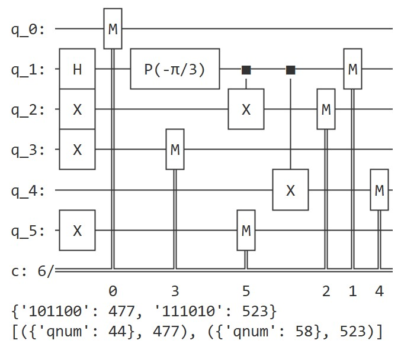
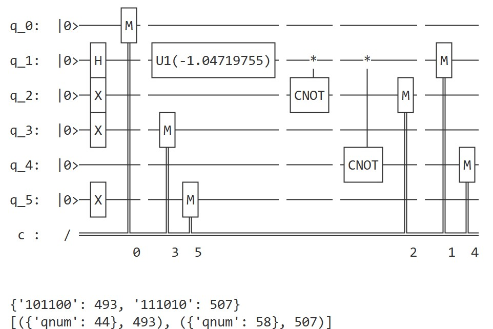

# PyQuantumKit简介

PyQuantumKit是一个基于Python的量子软件开发辅助工具，设计目标包括：

- 提供统一的方式在不同的基于Python的量子开发框架上构建量子线路，实现代码复用；
- 提供常用的量子算法和开发辅助功能，提升量子软件开发效率和正确性；
- 软件架构具有扩展性，未来可方便地添加更多的功能和量子开发框架的支持；
- 为量子软件新技术的研究提供实验平台。


# 安装和使用

使用`pip install`命令可安装PyQuantumKit

```sh
pip install pyquantumkit
```

PyQuantumKit要求Python版本>=3.8，且依赖如下Python包：

- sympy >= 1.8
- numpy >= 1.22.0
- packaging >= 20.0

通常，PyQuantumKit需要与受支持的基于Python的量子开发框架（例如qiskit或pyqpanda3等）联合使用。可以在安装PyQuantumKit的同时安装受支持的量子开发框架，例如，使用如下命令在安装PyQuantumKit的同时安装qiskit：

```sh
pip install "pyquantumkit[qiskit]"
```

使用`git clone`命令将PyQuantumKit仓库复制到本地：

```sh
git clone https://github.com/hiquarc/PyQuantumKit.git
```

用户文档参见：[https://pyquantumkit.readthedocs.io/](https://pyquantumkit.readthedocs.io/)

# v.0.2.0 重磅更新：高级语言级量子编程

编程语言的发展经历了从机器语言、汇编语言到高级语言的发展历程。尤其是高级语言的出现，极大地降低了编写计算机程序的门槛，提高了开发效率。

相比于成熟的经典（传统）程序的编程范式和编程语言，量子程序设计语言尚处于发展初期，当前量子编程尚处于较低层次的阶段。例如，开发者需要自行管理量子比特的分配，需要直接对单个量子比特进行操作（应用量子门），需要将各量子比特的测量结果自行转换为需要的格式等。下面用一段基于Qiskit编写的量子程序代码来进行说明。
```python
from qiskit import QuantumCircuit
from qiskit_aer import AerSimulator
from math import pi

qc = QuantumCircuit(6, 6)
qc.h(1)
qc.p(math.pi / 3, 1)
qc.x(2)
qc.x(3)
qc.x(5)
qc.cx(1, 2)
qc.cx(1, 4)
qc.measure(0, 0)
qc.measure(1, 1)
qc.measure(2, 2)
qc.measure(3, 3)
qc.measure(4, 4)
qc.measure(5, 5)

sim = AerSimulator()
result = sim.run(qc, shots = 1000).result()
print(result.get_counts())
```
这段程序声明了一个包含6个量子比特的量子线路，然后通过在这些量子比特上来应用门和测量操作来构建量子程序。这种编程方式类似于编写汇编语言代码：指定对第几号寄存器执行某个基本指令，指令序列构成汇编语言代码。事实上，上述代码执行的功能是有其逻辑意义的，然而开发者很难直观地从这一系列类似汇编指令的代码中看出代码的具体功能（正如反编译的难度）。

上述程序的（某一次）运行结果为：
```
{'101100': 511, '111010': 489}
```
可以看到，程序的运行结果是一系列`0/1`字符串及其对应的出现次数（组成的字典）。然而，在原始程序的逻辑中，`0/1`字符串有其对应的具体信息，用户还需要编写一个解释程序来从结果`0/1`字符串中提取出对应的信息。在编写结果解释程序的过程中，有一个需要被特别关注的问题：结果`0/1`字符串应该从左边开始读还是从右边开始读？换句话说，第一个量子比特（下标为0）的结果对应最左侧字符还是最右侧字符？事实上，结果字符串的顺序在不同的框架有不同的约定，例如Qiskit和QPanda3约定为从右开始读，而Quafu的约定为从左开始读。然而，这些框架的说明文档中均未重点提及结果字符串的顺序（甚至根本未提及），使得用户容易解读出错误的结果。

事实上，上述程序的执行的功能是：制备由整数 44 和 58 构成以及相对相位角 $\pi/3$ 构成的二值叠加量子态 $\frac{1}{\sqrt{2}}\left(\ket{44} + e^{i\pi/3}\ket{58}\right)$ 并测量。其中，十进制整数44和58以小端序二进制编码（即整数低位存储于量子比特数组低下标）的形式存入由6个量子比特构成的量子比特数组中，即实际制备的量子态为： $\frac{1}{\sqrt{2}}\left(\ket{0}\ket{1}\ket{0}\ket{1}\ket{1}\ket{1} + e^{i\pi / 3}\ket{0}\ket{0}\ket{1}\ket{1}\ket{0}\ket{1}\right)$ 。在对结果进行解读时，由于Qiskit的约定为从右开始读，因此结果字符串正好为整数的大端序二进制表示，故`'111010'`对应十进制整数58，`'101100'`对应十进制整数44。

## 量子编程：从“汇编语言”到“高级语言”

从上述代码示例可以看出，当前阶段量子编程类似于汇编语言。上述代码的功能如果用高级语言来描述，应该类似如下形式：
```python
# 定义一个量子整型（不妨称为QuInt）变量qnum，其包含6个量子比特
qnum = QuInt(6)

# 直接调用QuInt类型的方法来生成二值叠加量子态
qnum.create_two_value_superposition(44, 58, pi / 3)

# 对qnum进行测量
measure(qnum)
```
并且，量子整型变量的测量结果应该被直接输出为整数形式（而不是原始的`0/1`字符串），例如具有如下形式：
```
[({'qnum' : 44}, 511),
 ({'qnum' : 58}, 489)]
```
即量子整型变量`qnum`的测量结果中，有511次结果为44，有489次结果为58。这样，开发者无需关心量子整数的具体存储以及从结果字符串中恢复信息的细节（例如是大端序还是小端序），整个量子程序以及测量结果的可读性大大提高。

NISQ时代量子硬件可用的量子比特数目较少（数十个），像汇编语言一样直接操纵单个量子比特的编程方式或许还够用。然而，未来随着量子比特数目的进一步增加，直接操纵量子比特的编程范式将面临瓶颈，量子编程需要有一个从“汇编语言”到“高级语言”的跨越。

## 像C或Python程序一样来构建量子数据类型和编写量子程序

PyQuantumKit新加入`program`模块：

- 用户可以像写C或Python程序一样来编写面向过程的量子程序，并将其编译为可执行的量子线路。
- 用户可以自定义量子比特上的数据类型，并自定义其操作与测量结果解读方式（基于Python的语法）。
- 可以用包含量子变量的数组（QArray）、元组（QTuple）、结构体（QStruct）、联合体（QUnion）等数据组织形式来构建复杂量子数据类型。
- 结合PyQuantumKit已具有的跨量子开发框架的能力，编译结果可以翻译为Qiskit、QPanda3、Quafu等量子开发框架的量子线路，可以在模拟器或真实量子硬件上执行。
- 可以对以`0/1`字符串形式表示的结果字典进行解读，恢复为对应的数据类型所承载的信息。
- 基于Python实现，用户学习门槛低；在经典-量子混合编程中，可无缝衔接现有经典算法。

## 量子编程示例

这里用PyQuantumKit来重写上述程序：制备由整数 44 和 58 以及相对相位角 $\pi/3$ 构成的二值叠加量子态 $\frac{1}{\sqrt{2}}\left(\ket{44} + e^{i\pi/3}\ket{58}\right)$ 并测量。将程序分别编译为Qiskit和QPanda3的量子线路，在模拟器上运行，并按数据类型解读输出。

### 1. 首先导入Qiskit、QPanda3模块和math模块中的圆周率定义：
```python
import pyqpanda3.core as qpanda
import qiskit
import qiskit_aer
from math import pi
```

### 2. 然后导入PyQuantumKit的必需模块
**注意：**和量子线路级编程一样，**`import pyquantumkit`需放置在具体的量子开发包的导入之后**，以确保PyQuantumKit能识别已导入的量子开发包模块。
```python
from pyquantumkit import QProgramBuilder
from pyquantumkit.program.std import *
from pyquantumkit.program.quint import *
```

- `QProgramBuilder`类用于将量子程序构建为量子线路，并负责输出结果的解读。
- `pyquantumkit.program.std`模块包含了进行量子程序开发的必要定义。
- `from pyquantumkit.program.quint`模块包含了量子整型变量的类型定义。

### 3. 编写量子程序的main函数
```python
# 量子程序的main函数，第一个参数的类型必须为QProgramBuilder
def qmain(builder : QProgramBuilder):
    # 声明量子变量，这里声明一个量子整型变量qnum
    qnum = QuInt(6, 'qnum')
    # 这一行是必须的，调用declare_qvars()将局部变量与builder相关联
    builder.declare_qvars(qnum)

    # 函数主体，这里对量子整型变量qnum调用其成员方法，制备二值叠加态
    qnum.create_two_value_superposition(44, 58, pi / 3)

    # 对量子变量qnum进行测量
    builder.measure(qnum)
```

**量子程序的main函数的第一个参数必须为QProgramBuilder对象**，函数也可以带其他参数。建议将函数名命名为`qmain`，第一个参数写为`builder : QProgramBuilder`。

main函数的结构分为**变量声明、函数主体、测量操作**三大部分，且**必须保持此顺序**。

- 变量声明部分首先在函数体内定义局部变量，定义完成后调用`builder.declare_qvars(*args)`（这里的`builder`为main函数的第一个参数）函数将局部变量与`builder`相关联，以使其能进行后续量子比特分配和编译为量子线路的操作。**该函数需要且只能被调用一次**，因而如果有多个变量需要声明时，直接在参数列表中依次列出，例如`builder.declare_qvars(var1, var2, var3)`。如果该函数重复调用多次，会报错。
- 函数主体部分编写对已声明的量子变量的具体操作，只有声明过（即在`declare_qvars()`的参数中列出过）的变量才能进行操作。
- 测量部分只需调用`builder.declare_qvars(*args)`函数，其中参数依次列出需要测量的量子变量。和声明一样，该函数只能被调用一次，如果该函数重复调用多次，则会抛出`QProgramBuildError`异常。测量过后无法再对量子变量进行其他操作，否则会报错。

本例中，我们用`qnum = QuInt(6, 'qnum')`语句定义了一个函数内的局部变量`qnum`，变量类型为包含6个量子比特的量子整型（`QuInt`）。第二个参数的字符串`'qnum'`是变量的名称，在解读测量结果时会用到。然后，调用`builder.declare_qvars(qnum)`将局部变量`qnum`与builder相关联。

`qnum.create_two_value_superposition(44, 58, pi / 3)`语句调用量子整型变量`qnum`的成员方法`create_two_value_superposition()`，以给定的参数在该量子整型变量上制备所需量子态。

### 4. 将程序编译为量子线路
```python
# 声明一个QProgramBuilder类对象
qpbuilder = QProgramBuilder()
# 以qmain函数为参数调用QProgramBuilder对象的build()成员方法
qpbuilder.build(qmain)
```
首先声明一个QProgramBuilder对象，然后以`qmain`函数为参数调用成员方法`build()`，即可将量子程序`qmain`编译为量子线路。编译结果为一个`CircuitIO`对象，其中包含了生成的量子线路（可以理解为平台无关的量子线路的一种中间表示），可用成员方法`get_built_circuit()`获得此`CircuitIO`对象。

### 5. 在Qiskit框架上运行量子线路，并解读结果
```python
# ---------- Run on qiskit ----------
qiskit_cir = qiskit.QuantumCircuit(6, 6)

# 调用qpbuilder.get_built_circuit()获得编译完成的量子线路CircuitIO对象
#    然后使用>>运算符将其插入Qiskit量子线路中
qpbuilder.get_built_circuit() >> qiskit_cir
print(qiskit_cir)

# 在Qiskit模拟器上运行并获得结果字典
qiskit_sim = qiskit_aer.AerSimulator()
result = qiskit_sim.run(qiskit_cir, shots = 1000).result().get_counts()
print(result)

# 调用qpbuilder.interpret_result_dict()从结果字典中解读信息
rec_result = qpbuilder.interpret_result_dict(result, 'qiskit')
print(rec_result)
```
编译完成后，调用QProgramBuilder对象的成员方法`get_built_circuit()`获得此`CircuitIO`对象，然后使用`>>`运算符将其插入Qiskit量子线路中。在Qiskit模拟器上运行并获得结果字典，然后调用`qpbuilder.interpret_result_dict()`从结果字典中解读信息。运行结果为：


可以看到，编译生成的量子线路与前文手写的Qiskit程序相同。

量子线路后的第一行输出`{'101100': 477, '111010': 523}`是原始的Qiskit结果字典，它以`0/1`字符串形式表示测量结果。

第二行输出`[({'qnum': 44}, 477), ({'qnum': 58}, 523)]`是对原始结果字典进行解读得到的信息，它将量子整型变量`qnum`的测量结果以整数的形式展示出来。


### 6. 在QPanda3框架上运行量子线路，并解读结果
```python
# ---------- Run on pyqpanda3 ----------
qpanda_cir = qpanda.QProg()

# 调用qpbuilder.get_built_circuit()获得编译完成的量子线路CircuitIO对象
#    然后使用>>运算符将其插入QPanda3量子线路中
qpbuilder.get_built_circuit() >> qpanda_cir
print(qpanda_cir)

# 在QPanda3模拟器上运行并获得结果字典
qpanda_qvm = qpanda.CPUQVM()
qpanda_qvm.run(qpanda_cir, 1000)
qpanda_result = qpanda_qvm.result().get_counts()
print(qpanda_result)

# 调用qpbuilder.interpret_result_dict()从结果字典中解读信息
rec_result = qpbuilder.interpret_result_dict(qpanda_result, 'pyqpanda3')
print(rec_result)
```

运行结果为：



# 联系我们

PyQuantumKit由中国科学院高能物理研究所计算中心研发，得到了国家高能物理科学数据中心的支持。

项目负责人：龙沛洵
longpx@ihep.ac.cn

# 版本历史

**2026/8/31 v.0.2.0**

- **重磅更新：高级语言级量子编程（pyquantumkit.program模块）**
- 对软件架构进行了改动，以支持高级语言级量子编程。
- ......

2026/4/15 v.0.1.6
- 为项目添加说明文档

2026/3/27 v.0.1.5
- 新增一个支持的量子开发框架：cqlib
- CircuitIO类现在可以将线路导出为QSharp和isQ语言的代码
- 新增基于量子线路矩阵表示的线路等价性和恒等性检验函数

2026/1/20 v.0.1.4
- 新增符号运算库 (/symbol) ，用于构建量子线路的矩阵表示
- CircuitIO类现在能支持以sympy符号作为门的参数来构建量子线路
- 增加支持 $CS$ 、$CS^{\dagger}$ 、 $\sqrt{X}$ 和 $\sqrt{X}^{\dagger}$ 门

2025/12/04 v.0.1.3
- 新增apply_exp_pauli函数用于支持量子哈密顿模拟算法
- 新增量子哈密顿模拟算法库（实验性） (/library/hamiltonian.py)

2025/7/25 v.0.1.2
- 新增CircuitIO类，用于量子线路的格式化操作
- 修改了应用门的代码的翻译方式，以适应CircuitIO类输出为用户可读代码的功能

2025/7/10 v.0.1.1
- 首个预览版本 (v.0.1.1) 发布
