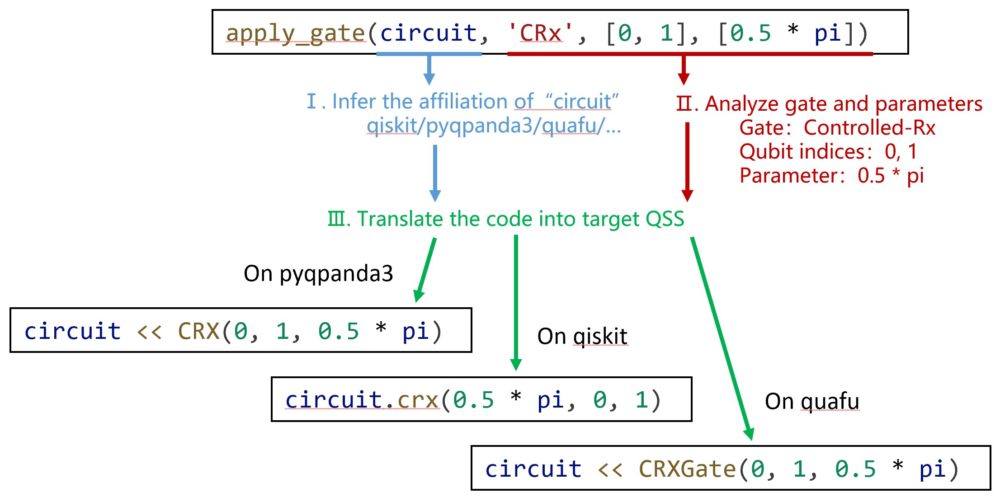

# Quantum Circuit Construction API
This page presents the API for constructing quantum circuits in PyQuantumKit for users' reference. All functions involved in this page can be used by including the following line at the beginning of the .py file:
```python
import pyquantumkit
```

## Basic Construction Functions
### apply_gate

The `apply_gate` function provides an interface for applying a quantum gate, with the following function prototype:
```python
def apply_gate(q_circuit, gate_str : str, qbits : list[int], paras : list = None)
```

- The parameter `q_circuit` specifies the target quantum circuit, which is of the quantum circuit class of each quantum development framework (e.g., `QuantumCircuit` of qiskit, `QCircuit` or `QProg` of pyqpanda3, `QuantumCircuit` of quafu, or `Circuit` of cqlib) or the `CircuitIO` class of PyQuantumKit.
- The parameter `gate_str` is a string indicating the gate to be applied. Considering that the same gate may have multiple different names (e.g., Toffoli, CCNOT, CCX all represent the same gate), PyQuantumKit allows using different name strings to represent the same gate, and the case is insensitive. [Click here to view](supported-gates.md) the specific supported quantum gates and their corresponding strings.
- The parameter `qbits` is a list of integers specifying the list of qubit indices to which the gate is to be applied. Note that whether the quantum gate is single-qubit or multi-qubit, this parameter must be assigned **in the form of a list**.
- The parameter `paras` is a list used to assign parameters to parameterized gates; for non-parameterized gates, this parameter does not need to be assigned.

The apply_gate function translates the application of the quantum gate into code corresponding to the quantum development framework according to the framework to which the incoming `q_circuit` parameter belongs. During the code translation process, the differences in API names and implementation methods of different quantum development frameworks have been considered. The figure below shows the process of code translation implemented by the apply_gate function:



In addition, if the target quantum development framework does not natively support a certain quantum gate, the function will translate it into a combination of supported quantum gates. For example, some quantum development frameworks do not support the $\sqrt{X}$ gate, and the function will translate it into the sequential application of $H$, $S$, and $H$ gates according to the identity $\sqrt{X}=HSH$.

### apply_measure
The `apply_measure` function implements measuring target qubits in a unified way, with the following function prototype:

```python
def apply_measure(q_circuit, qindex : list[int], cindex : list[int])
```

- The parameter `q_circuit` specifies the target quantum circuit.
- The parameter `qindex` is a list of integers specifying the indices of the qubits to be measured.
- The parameter `cindex` is a list of integers specifying the indices of the classical bits where the measurement results are stored. Each component of `qindex` and `cindex` corresponds respectively, so the lengths of `qindex` and `cindex` should be the same.

Example:
```python
apply_measure(qc, [2, 4, 6], [0, 1, 2])
```
Measure the qubits with indices 2, 4, and 6 in `qc`, and store the measurement results in the classical bits with indices 0, 1, and 2 respectively.

### multi_apply_sqgate
The `multi_apply_sqgate` function applies the same single-qubit quantum gate to each qubit in a set of qubits.

```python
def multi_apply_sqgate(q_circuit, gate_str : str, qbitlist : list[int], paras : list = None)
```

- The parameter `q_circuit` specifies the target quantum circuit.
- The parameter `gate_str` is a string indicating the gate to be applied.
- The parameter `qbitlist` is a list of integers; the function treats the list elements as indices and applies the quantum gate represented by `gate_str` to each corresponding qubit.
- The parameter `paras` is a list used to assign parameters to parameterized gates; for non-parameterized gates, this parameter does not need to be assigned.

Example:
```python
multi_apply_sqgate(qc, 'H', range(7))
```
Apply an H gate to each of the qubits with indices 0~6 (7 qubits in total) in `qc`.

### apply_reverse
The `apply_reverse` function applies a series of SWAP operations to reverse the order of qubits.

```python
def apply_reverse(q_circuit, qbitlist : list[int])
```

- The parameter `q_circuit` specifies the target quantum circuit.
- The parameter `qbitlist` is a list of integers specifying the list of qubit indices to which the gate is to be applied.

Specifically, the function applies a SWAP gate to the first and last qubits corresponding to the index array `qbitlist`, a SWAP gate to the second and second-last qubits, and so on.

## Modular Construction
[Click here to view](../../experimental/construct.md)
