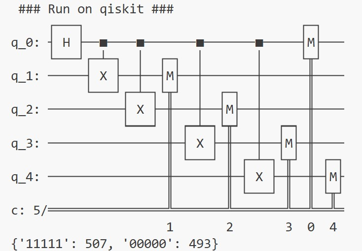
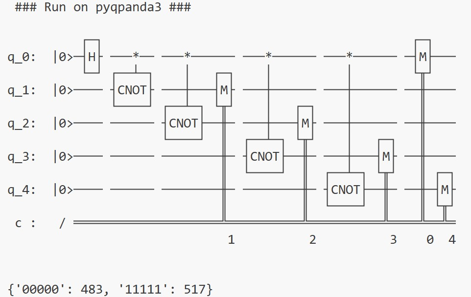
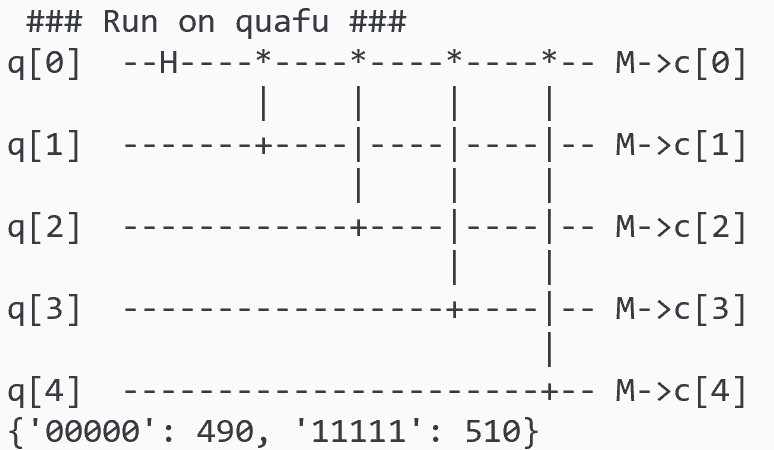

## 二、使用示例

这里以一个简单的示例来说明如何利用PyQuantumKit在不同的量子开发框架构建量子线路，本例是`./examples/ghz_state.py`。

需求：构造一个生成GHZ状态的量子线路，运行1000次并获得测量的统计结果。编写一次代码，分别使用qiskit、pyqpanda3和quafu三个量子开发框架的模拟器运行。

#### 1. 导入需要的量子开发框架和PyQuantumKit

**请注意pyquantumkit需在量子开发框架之后导入**

```python
# import quantum software stacks
import pyqpanda3.core as qpanda
import qiskit, qiskit_aer
import quafu
# import PyQuantumKit
import pyquantumkit as PQK
```

#### 2. 利用PyQuantumKit提供的函数编写线路

```python
def ghz_state(circuit, nqbits : int):
    PQK.apply_gate(circuit, 'H', [0])               # Apply H gate on qubit with index 0
    for i in range(1, nqbits):
        PQK.apply_gate(circuit, 'cnot', [0, i])     # Apply CNOT gate on qubit with index 0 and i
    # Measure all qubits
    PQK.apply_measure(circuit, range(nqbits), range(nqbits))
```

#### 3. 设定运行参数
这里使用5个qubit，运行轮数为1000

```python
# The number of qubits
Nqs = 5
# The number of running shots
Nshots = 1000
```

#### 4. 在qiskit上运行

```python
print(' ### Run on qiskit ### ')

qiskit_circuit = qiskit.QuantumCircuit(Nqs, Nqs)
ghz_state(qiskit_circuit, Nqs)    # unified quantum circuit construction
print(qiskit_circuit)             # print quantum circuit

qiskit_qvm = qiskit_aer.Aer.get_backend('aer_simulator')
qiskit_job = qiskit_qvm.run(qiskit_circuit, shots = Nshots)
qiskit_result = qiskit_job.result().get_counts()
print(qiskit_result)        # print running results
```

运行结果为：


#### 5. 在pyqpanda3上运行

```python
print(' ### Run on pyqpanda3 ### ')

qpanda_circuit = qpanda.QProg(Nqs)
ghz_state(qpanda_circuit, Nqs)    # unified quantum circuit construction
print(qpanda_circuit)             # print quantum circuit

qpanda_qvm = qpanda.CPUQVM()
qpanda_qvm.run(qpanda_circuit, Nshots)
qpanda_result = qpanda_qvm.result().get_counts()
print(qpanda_result)        # print running results
```

运行结果为：


#### 6. 在quafu上运行

```python
print(' ### Run on quafu ### ')

quafu_circuit = quafu.QuantumCircuit(Nqs, Nqs)
ghz_state(quafu_circuit, Nqs)    # unified quantum circuit construction
quafu_circuit.draw_circuit()     # print quantum circuit

quafu_result = quafu.simulate(quafu_circuit, shots = Nshots)
print(quafu_result.counts)    # print running results
```

运行结果为：


#### 7. 更多的例子可在`./examples`文件夹下找到。
