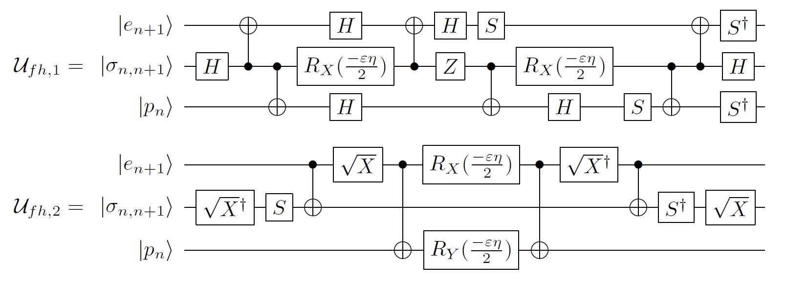
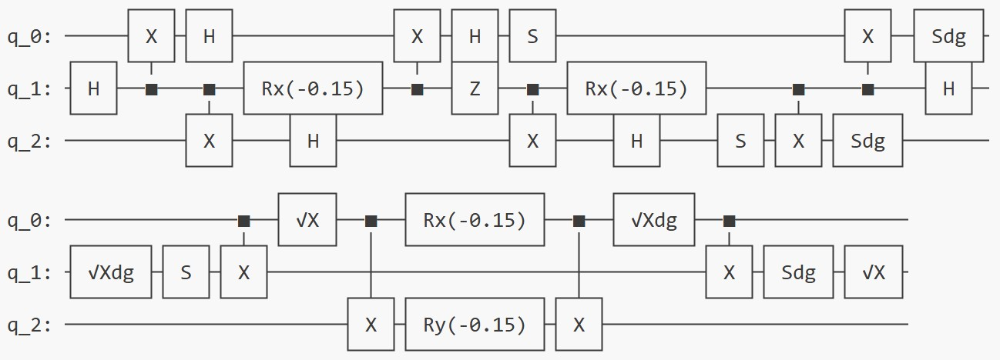
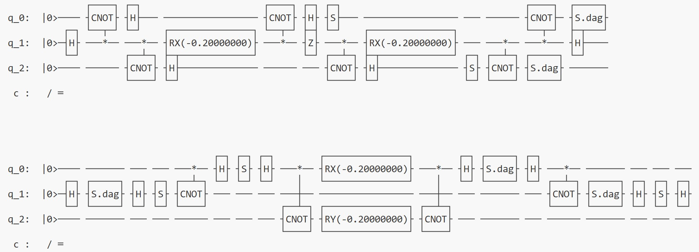

# Example: Symbolic Representation and Verification of Parametric Quantum Circuits

This example demonstrates how to use the symbolic representation functionality provided by PyQuantumKit to construct quantum circuits with symbolic variables, then perform equivalence verification, and finally substitute specific numerical values for the symbols to generate concrete quantum circuits on quantum development frameworks. The example circuits are from the following paper:

> Simulating $\mathbb{Z}_2$ lattice gauge theory on a quantum computer.
> [https://arxiv.org/abs/2305.02361](https://arxiv.org/abs/2305.02361)

The two quantum circuits (denoted as Ufh1 and Ufh2 respectively) contain symbolic variables $\epsilon$ and $\eta$, as shown in the figure below:



First, import the necessary modules, then define two sympy symbolic variables to represent $\epsilon$ and $\eta$ respectively.

```python
import pyqpanda3.core as qpanda
import qiskit, qiskit_aer
import quafu
import pyquantumkit as PQK
import sympy

eta_ = sympy.Symbol('eta')
epsilon_ = sympy.Symbol('epsilon')
```

Next, we write functions to construct these two quantum circuits respectively, where the parameters of the Rx and Ry gates are directly assigned to symbolic variables.

```python
def build_Ufh1(qc):
    PQK.apply_gate(qc, 'H', [1])
    PQK.apply_gate(qc, 'CNOT', [1, 0])
    PQK.apply_gate(qc, 'CNOT', [1, 2])
    PQK.apply_gate(qc, 'H', [0])
    PQK.apply_gate(qc, 'Rx', [1], [-epsilon_ * eta_ / 2])
    PQK.apply_gate(qc, 'H', [2])
    PQK.apply_gate(qc, 'CNOT', [1, 0])
    PQK.apply_gate(qc, 'H', [0])
    PQK.apply_gate(qc, 'Z', [1])
    PQK.apply_gate(qc, 'S', [0])
    PQK.apply_gate(qc, 'CNOT', [1, 2])
    PQK.apply_gate(qc, 'Rx', [1], [-epsilon_ * eta_ / 2])
    PQK.apply_gate(qc, 'H', [2])
    PQK.apply_gate(qc, 'S', [2])
    PQK.apply_gate(qc, 'CNOT', [1, 2])
    PQK.apply_gate(qc, 'CNOT', [1, 0])
    PQK.apply_gate(qc, 'Sdag', [0])
    PQK.apply_gate(qc, 'H', [1])
    PQK.apply_gate(qc, 'Sdag', [2])

def build_Ufh2(qc):
    PQK.apply_gate(qc, 'SqrtXdag', [1])
    PQK.apply_gate(qc, 'S', [1])
    PQK.apply_gate(qc, 'CNOT', [0, 1])
    PQK.apply_gate(qc, 'SqrtX', [0])
    PQK.apply_gate(qc, 'CNOT', [0, 2])
    PQK.apply_gate(qc, 'Rx', [0], [-epsilon_ * eta_ / 2])
    PQK.apply_gate(qc, 'Ry', [2], [-epsilon_ * eta_ / 2])
    PQK.apply_gate(qc, 'CNOT', [0, 2])
    PQK.apply_gate(qc, 'SqrtXdag', [0])
    PQK.apply_gate(qc, 'CNOT', [0, 1])
    PQK.apply_gate(qc, 'Sdag', [1])
    PQK.apply_gate(qc, 'SqrtX', [1])
```

Then declare two CircuitIO objects and construct these two quantum circuits on them.

```python
# Declare two CircuitIO objects
CIO_Ufh1 = PQK.CircuitIO(3)
CIO_Ufh2 = PQK.CircuitIO(3)
# Build circuits on CircuitIO objects
build_Ufh1(CIO_Ufh1)
build_Ufh2(CIO_Ufh2)
```

Calculate the matrix representations of the two quantum circuits using the `get_sympy_matrix` function:

```python
mat1 = CIO_Ufh1.get_sympy_matrix()
mat2 = CIO_Ufh2.get_sympy_matrix()
print(mat1)
print(mat2)
```

The output is

```
Matrix([[1, 0, 0, 0, 0, 0, 0, 0],
        [0, cos(epsilon*eta/2), 0, 0, I*sin(epsilon*eta/2), 0, 0, 0],
        [0, 0, 1, 0, 0, 0, 0, 0],
        [0, 0, 0, cos(epsilon*eta/2), 0, 0, -I*sin(epsilon*eta/2), 0],
        [0, I*sin(epsilon*eta/2), 0, 0, cos(epsilon*eta/2), 0, 0, 0],
        [0, 0, 0, 0, 0, 1, 0, 0],
        [0, 0, 0, -I*sin(epsilon*eta/2), 0, 0, cos(epsilon*eta/2), 0],
        [0, 0, 0, 0, 0, 0, 0, 1]])
Matrix([[1, 0, 0, 0, 0, 0, 0, 0],
        [0, cos(epsilon*eta/2), 0, 0, -I*sin(epsilon*eta/2), 0, 0, 0],
        [0, 0, 1, 0, 0, 0, 0, 0],
        [0, 0, 0, cos(epsilon*eta/2), 0, 0, I*sin(epsilon*eta/2), 0],
        [0, -I*sin(epsilon*eta/2), 0, 0, cos(epsilon*eta/2), 0, 0, 0],
        [0, 0, 0, 0, 0, 1, 0, 0],
        [0, 0, 0, I*sin(epsilon*eta/2), 0, 0, cos(epsilon*eta/2), 0],
        [0, 0, 0, 0, 0, 0, 0, 1]])
```

We can subtract the two matrices and compare the difference with the zero matrix to verify the equivalence of the two quantum circuits:

```python
diff = sympy.simplify(mat1 - mat2)
print(diff)
```

```
Matrix([[0, 0, 0, 0, 0, 0, 0, 0],
        [0, 0, 0, 0, 2*I*sin(epsilon*eta/2), 0, 0, 0],
        [0, 0, 0, 0, 0, 0, 0, 0],
        [0, 0, 0, 0, 0, 0, -2*I*sin(epsilon*eta/2), 0],
        [0, 2*I*sin(epsilon*eta/2), 0, 0, 0, 0, 0, 0],
        [0, 0, 0, 0, 0, 0, 0, 0],
        [0, 0, 0, -2*I*sin(epsilon*eta/2), 0, 0, 0, 0],
        [0, 0, 0, 0, 0, 0, 0, 0]])
```

The difference between the two matrices is not the zero matrix, so the two quantum circuits are not equivalent. (Note: In fact, if the matrices of two quantum circuits differ only by a global phase factor $e^{i\theta}$, they can also be considered equivalent because the global phase is indistinguishable. However, it is easy to see that the two matrices in this example do not differ only by a phase factor, so we can assert that they are not equivalent.)

Finally, we implement the quantum circuits on two quantum development frameworks (qiskit and pyqpanda3) and substitute different numerical values for the symbolic variables. This is done using the `append_into_actual_circuit` member function of the CircuitIO class, with the specified parameter `subsdict` as a dictionary representing the substitution. For example, to substitute the value 1 for `eta_` and 0.3 for `epsilon_`, the parameter should be specified as `{eta_ : 1, epsilon_ : 0.3}`.

The following code exports the quantum circuits in the CircuitIO class to two quantum development frameworks respectively, where $\eta=1, \epsilon=0.3$ are substituted on qiskit, and $\eta=2, \epsilon=0.2$ are substituted on pyqpanda3, then prints each quantum circuit.

```python
# ---------- Implement on Qiskit ----------
qiskit_circuit1 = qiskit.QuantumCircuit(3)
# Substitute the symbols: eta_ = 1, epsilon_ = 0.3
CIO_Ufh1.append_into_actual_circuit(qiskit_circuit1, {eta_ : 1, epsilon_ : 0.3})
print(qiskit_circuit1)

qiskit_circuit2 = qiskit.QuantumCircuit(3)
# Substitute the symbols: eta_ = 1, epsilon_ = 0.3
CIO_Ufh2.append_into_actual_circuit(qiskit_circuit2, {eta_ : 1, epsilon_ : 0.3})
print(qiskit_circuit2)

# ---------- Implement on QPanda3 ----------
qpanda_circuit1 = qpanda.QCircuit(3)
# Substitute the symbols: eta_ = 2, epsilon_ = 0.2
CIO_Ufh1.append_into_actual_circuit(qpanda_circuit1, {eta_ : 2, epsilon_ : 0.2})
print(qpanda_circuit1)

qpanda_circuit2 = qpanda.QCircuit(3)
# Substitute the symbols: eta_ = 2, epsilon_ = 0.2
CIO_Ufh2.append_into_actual_circuit(qpanda_circuit2, {eta_ : 2, epsilon_ : 0.2})
print(qpanda_circuit2)
```

The running results are:

- On qiskit:


- On pyqpanda3:


Note that although the pyqpanda3 framework does not support $\sqrt{X}$ and $\sqrt{X}^{\dagger}$ gates, PyQuantumKit can automatically translate unsupported gates into equivalent combinations of supported gates: $\sqrt{X}=HSH$ and $\sqrt{X}^{\dagger}=HS^{\dagger}H$.
