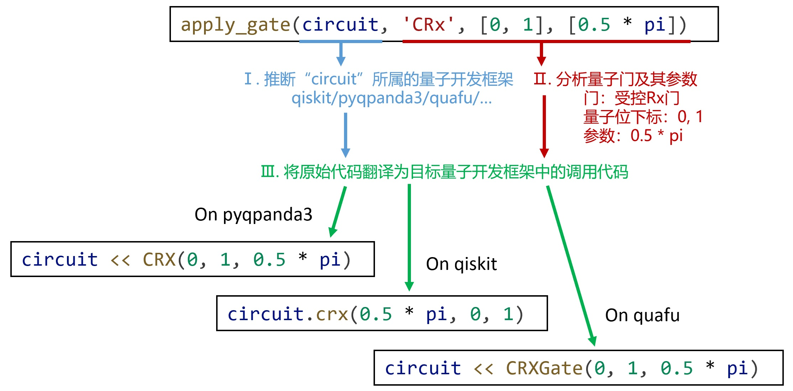

# 量子线路构建API
本页给出PyQuantumKit中构建量子线路的API，供用户查阅。本页涉及的所有函数只需要在.py文件的开头包含：
```python
import pyquantumkit
```
即可使用。

## 基本构建函数
### apply_gate

`apply_gate`函数提供了应用一个量子门的接口，函数原型为：
```python
def apply_gate(q_circuit, gate_str : str, qbits : list[int], paras : list = None)
```

- 参数`q_circuit`指定目标量子线路，它的类型是各量子开发框架的量子线路类（例如qiskit的`QuantumCircuit`、pyqpanda3的`QCircuit`或`QProg`、quafu的`QuantumCircuit`或cqlib的`Circuit`）或PyQuantumKit的`CircuitIO`类。
- 参数`gate_str`是一个字符串，用于指示需要应用的门。考虑到同一个门可能有多个不同的名称（例如Toffoli,CCNOT,CCX都表示同一个门），PyQuantumKit允许以不同的名字字符串来表示同一个门，且不区分大小写。[点此查看](../api/supported-gates.md)具体支持的量子门及其对应的字符串。
- 参数`qbits`是一个整数列表，指定门要应用的量子比特下标列表。注意无论量子门是单比特还是多比特，都需要**以列表的方式指派此参数**。
- 参数`paras`是一个列表，用于为含参数门指派参数；对于无参数门，不用指派此参数。

apply_gate函数将根据传入的`q_circuit`参数所属的量子开发框架，将对量子门的应用翻译为对应量子开发框架的代码。代码翻译过程中已考虑不同量子开发框架的API名称和实现方式的差别。下图展示了apply_gate函数实现代码翻译的流程：



此外，若目标量子开发框架不原生支持某个量子门，函数则会将其翻译为支持的量子门的组合。例如，一些量子开发框架不支持 $\sqrt{X}$ 门，函数会根据恒等式 $\sqrt{X}=HSH$ 将其翻译为 $H$, $S$, $H$ 门的依次应用。

### apply_measure
`apply_measure`函数以统一的方式实现测量目标量子比特，函数原型为：

```python
def apply_measure(q_circuit, qindex : list[int], cindex : list[int])
```

- 参数`q_circuit`指定目标量子线路。
- 参数`qindex`是一个整数列表，指定要测量的量子比特下标。
- 参数`cindex`是一个整数列表，指定测量结果存放的经典比特下标。`qindex`和`cindex`各分量分别对应，因此`qindex`和`cindex`长度应相同。

例如：
```python
apply_measure(qc, [2, 4, 6], [0, 1, 2])
```
测量`qc`中下标为2、4和6的量子比特，并将测量结果分别存入下标为0、1、2的经典比特中。

### multi_apply_sqgate
`multi_apply_sqgate`函数对一组量子比特中的每一个量子比特应用同一个单比特量子门。

```python
def multi_apply_sqgate(q_circuit, gate_str : str, qbitlist : list[int], paras : list = None)
```

- 参数`q_circuit`指定目标量子线路。
- 参数`gate_str`是一个字符串，用于指示需要应用的门。
- 参数`qbitlist`是一个整数列表，函数将列表元素视为下标，对相应的每一个量子比特应用`gate_str`代表的量子门。
- 参数`paras`是一个列表，用于为含参数门指派参数；对于无参数门，不用指派此参数。

例如：
```python
multi_apply_sqgate(qc, 'H', range(7))
```
对`qc`的下标为0~6的量子比特（共7个）的每一个分别应用一个H门。

### apply_reverse
`apply_reverse`函数应用一些列SWAP操作，反转量子比特顺序。

```python
def apply_reverse(q_circuit, qbitlist : list[int])
```

- 参数`q_circuit`指定目标量子线路。
- 参数`qbitlist`是一个整数列表，指定门要应用的量子比特下标列表。

具体而言，该函数对下标数组`qbitlist`对应的首个量子比特和最后一个量子比特应用SWAP门，对第二个和倒数第二个应用SWAP门，以此类推。

## 模块化构建
[点此查看](../experimental/construct.md)
