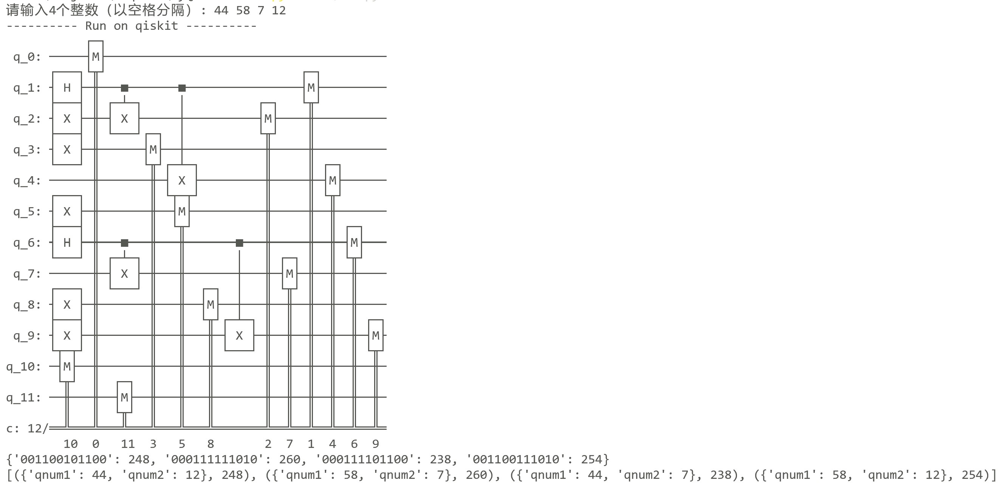
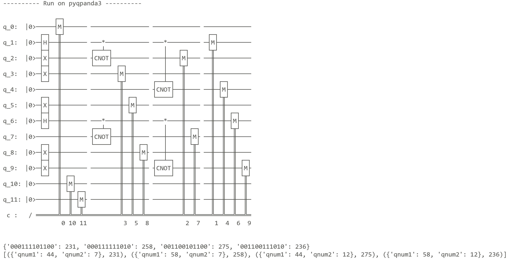

# PyQuantumKit高级量子编程演示示例

这里我们给出两个具体的例子来展示如何利用PyQuantumKit进行高级语言级量子编程。

## 例1. 本节概览中的程序

这里用PyQuantumKit来编写[本节概览](introduction.md)中的程序：制备由整数 44 和 58 以及相对相位角 $\pi/3$ 构成的二值叠加量子态 $\frac{1}{\sqrt{2}}\left(\ket{44} + e^{i\pi/3}\ket{58}\right)$ 并测量。将程序分别编译为Qiskit和QPanda3的量子线路，在模拟器上运行，并按数据类型解读输出。

### 1. 首先导入Qiskit、QPanda3模块和math模块中的圆周率定义：
```python
import pyqpanda3.core as qpanda
import qiskit
import qiskit_aer
from math import pi
```

### 2. 然后导入PyQuantumKit的必需模块
**注意：**和量子线路级编程一样，**`import pyquantumkit`需放置在具体的量子开发包的导入之后**，以确保PyQuantumKit能识别已导入的量子开发包模块。
```python
from pyquantumkit import QProgramBuilder
from pyquantumkit.program.std import *
from pyquantumkit.program.quint import *
```

- `QProgramBuilder`类用于将量子程序构建为量子线路，并负责输出结果的解读。
- `pyquantumkit.program.std`模块包含了进行量子程序开发的必要定义。
- `pyquantumkit.program.quint`模块包含了量子整型变量的类型定义。

### 3. 编写量子程序的main函数
```python
# 量子程序的main函数，第一个参数的类型必须为QProgramBuilder
def qmain(builder : QProgramBuilder):
    # 声明量子变量，这里声明一个量子整型变量qnum
    qnum = QuInt(6, 'qnum')
    # 这一行是必须的，调用declare_qvars()将局部变量与builder相关联
    builder.declare_qvars(qnum)

    # 函数主体，这里对量子整型变量qnum调用其成员方法，制备二值叠加态
    qnum.create_two_value_superposition(44, 58, pi / 3)

    # 对量子变量qnum进行测量
    builder.measure(qnum)
```

**量子程序的main函数的第一个参数必须为QProgramBuilder对象**，函数也可以带其他参数。建议将函数名命名为`qmain`，第一个参数写为`builder : QProgramBuilder`。

main函数的结构分为**变量声明、函数主体、测量操作**三大部分，且**必须保持此顺序**。

- 变量声明部分首先在函数体内定义局部变量，定义完成后调用`builder.declare_qvars(*args)`（这里的`builder`为main函数的第一个参数）函数将局部变量与`builder`相关联，以使其能进行后续量子比特分配和编译为量子线路的操作。**该函数需要且只能被调用一次**，因而如果有多个变量需要声明时，直接在参数列表中依次列出，例如`builder.declare_qvars(var1, var2, var3)`。如果该函数重复调用多次，会报错。
- 函数主体部分编写对已声明的量子变量的具体操作，只有声明过（即在`declare_qvars()`的参数中列出过）的变量才能进行操作。
- 测量部分只需调用`builder.declare_qvars(*args)`函数，其中参数依次列出需要测量的量子变量。和声明一样，该函数只能被调用一次，如果该函数重复调用多次，则会报错。测量过后无法再对量子变量进行其他操作，否则会报错。

本例中，我们用`qnum = QuInt(6, 'qnum')`语句定义了一个函数内的局部变量`qnum`，变量类型为包含6个量子比特的量子整型（`QuInt`）。第二个参数的字符串`'qnum'`是变量的名称，在解读测量结果时会用到。然后，调用`builder.declare_qvars(qnum)`将局部变量`qnum`与builder相关联。

`qnum.create_two_value_superposition(44, 58, pi / 3)`语句调用量子整型变量`qnum`的成员方法`create_two_value_superposition()`，以给定的参数在该量子整型变量上制备所需量子态。

### 4. 将程序编译为量子线路
```python
# 声明一个QProgramBuilder类对象
qpbuilder = QProgramBuilder()
# 以qmain函数为参数调用QProgramBuilder对象的build()成员方法
qpbuilder.build(qmain)
```
首先声明一个QProgramBuilder对象，然后以`qmain`函数为参数调用成员方法`build()`，即可将量子程序`qmain`编译为量子线路。编译结果为一个`CircuitIO`对象，其中包含了生成的量子线路（可以理解为平台无关的量子线路的一种中间表示），可用成员方法`get_built_circuit()`获得此`CircuitIO`对象。

### 5. 在Qiskit框架上运行量子线路，并解读结果
```python
# ---------- Run on qiskit ----------
qiskit_cir = qiskit.QuantumCircuit(6, 6)

# 调用qpbuilder.get_built_circuit()获得编译完成的量子线路CircuitIO对象
#    然后使用>>运算符将其插入Qiskit量子线路中
qpbuilder.get_built_circuit() >> qiskit_cir
print(qiskit_cir)

# 在Qiskit模拟器上运行并获得结果字典
qiskit_sim = qiskit_aer.AerSimulator()
result = qiskit_sim.run(qiskit_cir, shots = 1000).result().get_counts()
print(result)

# 调用qpbuilder.interpret_result_dict()从结果字典中解读信息
rec_result = qpbuilder.interpret_result_dict(result, 'qiskit')
print(rec_result)
```
编译完成后，调用QProgramBuilder对象的成员方法`get_built_circuit()`获得此`CircuitIO`对象，然后使用`>>`运算符将其插入Qiskit量子线路中。在Qiskit模拟器上运行并获得结果字典，然后调用`qpbuilder.interpret_result_dict()`从结果字典中解读信息。运行结果为：
<div align="left">

</div>

可以看到，编译生成的量子线路与[本节概览](introduction.md)中手写的Qiskit程序相同。

量子线路后的第一行输出`{'101100': 477, '111010': 523}`是原始的Qiskit结果字典，它以`0/1`字符串形式表示测量结果。

第二行输出`[({'qnum': 44}, 477), ({'qnum': 58}, 523)]`是对原始结果字典进行解读得到的信息，它将量子整型变量`qnum`的测量结果以整数的形式展示出来。


### 6. 在QPanda3框架上运行量子线路，并解读结果
```python
# ---------- Run on pyqpanda3 ----------
qpanda_cir = qpanda.QProg()

# 调用qpbuilder.get_built_circuit()获得编译完成的量子线路CircuitIO对象
#    然后使用>>运算符将其插入QPanda3量子线路中
qpbuilder.get_built_circuit() >> qpanda_cir
print(qpanda_cir)

# 在QPanda3模拟器上运行并获得结果字典
qpanda_qvm = qpanda.CPUQVM()
qpanda_qvm.run(qpanda_cir, 1000)
qpanda_result = qpanda_qvm.result().get_counts()
print(qpanda_result)

# 调用qpbuilder.interpret_result_dict()从结果字典中解读信息
rec_result = qpbuilder.interpret_result_dict(qpanda_result, 'pyqpanda3')
print(rec_result)
```

运行结果为：
<div align="left">

</div>

## 例2. 从命令行输入整数并构建量子态

例1仅使用了一个量子变量，事实上，PyQuantumKit还支持定义多个量子变量。在生成量子线路的过程中，可以自动为各量子变量分配所需的量子比特，并且在解读测量的结果的过程中也可以自动分离各量子变量对应的测量结果经典比特。此外，PyQuantumKit还支持经典-量子混合编程。

本例给出一个稍微复杂的例子，它同时包含经典和量子逻辑：从命令行输入4个0~63之间的整数 $a, b, c, d$ ，检查输入是否满足要求，如果不满足，则要求用户重新输入，直到满足要求。然后，分别制备两个量子整型变量的量子态 $\frac{1}{\sqrt{2}}\left(\ket{a} + \ket{b}\right)$ 和 $\frac{1}{\sqrt{2}}\left(\ket{c} + \ket{d}\right)$ 并测量，其中每个量子整型变量包含6个量子比特。在Qiskit和QPanda3两个框架上分别构建量子线路。

### 1. 导入量子开发框架和PyQuantumKit
```python
import pyqpanda3.core as qpanda
import qiskit
import qiskit_aer

from pyquantumkit import QProgramBuilder
from pyquantumkit.program.std import *
from pyquantumkit.program.quint import *
```

### 2. 编写读入和检查输入的逻辑
这里我们将其编写为一个函数`input_numbers()`，如果校验通过则返回对应的整数列表，否则返回`None`。
```python
# 从命令行中读入整数，并进行校验
def input_numbers() -> list[int]:
    # 从命令行读取输入（默认以空格分隔）
    raw_input = input("请输入4个整数（以空格分隔）: ").split()
    
    # 校验输入数量
    if len(raw_input) != 4:
        print("错误：请输入恰好4个整数。")
        return None
    try:
        # 转换为整数列表（若包含非数字字符会触发 ValueError）
        nums = [int(x) for x in raw_input]
        # 逐一检查范围是否在 [0, 63]
        for i, val in enumerate(nums, start=1):
            if not (0 <= val <= 63):
                print(f"错误：第{i}个整数 {val} 不在 0 ~ 63 范围内。")
                return None
        # 全部满足约束，返回列表
        return nums    
    except ValueError:
        print("错误：输入包含非整数字符，请输入有效的整数。")
        return None
```

### 3. 利用PyQuantumKit编写量子程序入口qmain函数
```python
# qmain函数的第一个参数是QProgramBuilder对象，后面跟着4个整数参数
def qmain(builder : QProgramBuilder, a : int, b : int, c : int, d : int):
    # 定义两个量子整型变量qnum1, qnum2
    qnum1 = QuInt(6, 'qnum1')
    qnum2 = QuInt(6, 'qnum2')
    builder.declare_qvars(qnum1, qnum2)

    qnum1.create_two_value_superposition(a, b)    # 制备 |a>+|b> 态
    qnum2.create_two_value_superposition(c, d)    # 制备 |c>+|d> 态

    # measure_all()函数依次测量所有声明的量子变量
    builder.measure_all()
```
量子程序的main函数除了第一个参数必须为`QProgramBuilder`对象外，还可以在后面附加额外的（经典）参数，以实现经典-量子混合编程从外界传入经典数据。

### 4. 读入输入，校验输入，校验通过后将量子程序构建为量子线路
```python
numbers = input_numbers()
while numbers is None:
    # 校验不通过，要求用户重新输入
    numbers = input_numbers()

# 校验通过，开始构建量子程序
a, b, c, d = numbers
qpbuilder = QProgramBuilder()
# build()函数的第一个参数为qmain，后面的参数依次传入qmain所需的4个整数
qpbuilder.build(qmain, a, b, c, d)
```

### 5. 在Qiskit和QPanda3上的运行
```python
# ---------- Run on qiskit ----------
print("---------- Run on qiskit ----------")
qiskit_cir = qiskit.QuantumCircuit(12, 12)
qpbuilder.get_built_circuit() >> qiskit_cir
print(qiskit_cir)

qiskit_sim = qiskit_aer.AerSimulator()
result = qiskit_sim.run(qiskit_cir, shots = 1000).result().get_counts()
print(result)

rec_result = qpbuilder.interpret_result_dict(result, 'qiskit')
print(rec_result)

# ---------- Run on pyqpanda3 ----------
print("---------- Run on pyqpanda3 ----------")
qpanda_cir = qpanda.QProg()
qpbuilder.get_built_circuit() >> qpanda_cir
print(qpanda_cir)

qpanda_qvm = qpanda.CPUQVM()
qpanda_qvm.run(qpanda_cir, 1000)
qpanda_result = qpanda_qvm.result().get_counts()
print(qpanda_result)

rec_result = qpbuilder.interpret_result_dict(qpanda_result, 'pyqpanda3')
print(rec_result)
```

### 6. 运行结果
首先检验在不符合要求的输入下的运行结果：

```
请输入4个整数（以空格分隔）: 3 4 5↵
错误：请输入恰好4个整数。
请输入4个整数（以空格分隔）:
```

```
请输入4个整数（以空格分隔）: 4 g 3 2↵
错误：输入包含非整数字符，请输入有效的整数。
请输入4个整数（以空格分隔）:
```

```
请输入4个整数（以空格分隔）: 23 45 63 99↵
错误：第4个整数 99 不在 0 ~ 63 范围内。
请输入4个整数（以空格分隔）:
```

然后我们输入一组符合要求的数字，这里输入 `44 58 7 12`，运行结果为：

构建为Qiskit量子线路，然后运行并解读结果为：



显然，整个量子程序需要6+6=12个量子比特，总的量子态为 $\frac{1}{\sqrt{2}}\left(\ket{44} + \ket{58}\right) \otimes \frac{1}{\sqrt{2}}\left(\ket{7} + \ket{12}\right) = \frac{1}{2}(\ket{44}\ket{7} + \ket{58}\ket{7} + \ket{44}\ket{12} + \ket{58}\ket{12})$ 。

可以看到，第0~5号量子比特被分配给变量`qnum1`，第6~11号量子比特被分配给变量`qnum2`。测量结果的组合恰好是(44, 7)、(58, 7)、(44, 12)、(58, 12)四种，符合预期。
