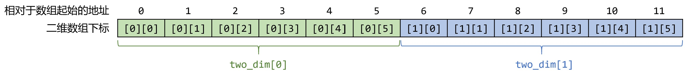

# 量子变量内存布局和量子比特分配
高级语言级量子程序编译到量子线路的过程中，需要对各量子变量分配对应的量子比特，而在构造复合量子数据类型的过程中，又需要对其中的各元素或字段分配量子比特。本节介绍量子程序及各类量子数据类型中的量子变量是如何布局和分配的。

## 一、数组、结构体、联合体的内存布局
PyQuantumKit中，数组（QArray）、结构体（QStruct）和联合体（QUnion）的内存布局与C语言中的对应的数组、结构体和联合体的内存布局类似。

数组的内存布局是其中各元素的连续分配。例如，下列二维数组
```python
    twodim = make_qarray(QubitArray(6), 2, 'twodim')
```
的内存布局如图：


结构体的内存布局是其中各字段变量的**无空隙的连续分配**，不存在C语言中结构体可能出现的字节对齐导致留空隙。下列结构体
```python
class MyStruct(QStruct):
    def __init__(self, varname=None):
        super().__init__(varname)

        self.x = QubitArray(3, 'x')
        self.y = make_qarray(QubitArray(2), 2, 'y')
        self.z = Qubit('z')

        self.init_qstruct(self.x, self.y, self.z)
```
的内存布局如图：
<div align="left">

</div>

结构体中各字段的分配顺序以调用`init_qstruct()`函数的参数顺序为准。

联合体的所有字段拥有相同的起始地址，共用同一段量子内存。下列结构体`MyUnion`
```python
class MyUnion(QUnion):
    def __init__(self, varname=None):
        super().__init__(varname)

        self.x = QubitArray(3, 'x')
        self.y = make_qarray(QubitArray(2), 2, 'y')
        self.z = Qubit('z')

        self.init_qunion(self.x, self.y, self.z)
```
的字段定义与`MyStruct`相同，它的内存布局如图：
<div align="left">

</div>

### 获取量子变量的量子比特数：n_qubits()方法
每个量子变量都需要占据一个或多个量子比特，可以调用量子变量的`n_qubits()`方法获得其占据的量子比特数。
```python
def qmain(builder : QProgramBuilder, a : int, b : int, c : int, d : int):
    twodim = make_qarray(QubitArray(6), 2, 'twodim')
    mystruct = MyStruct('mystruct')
    myunion = MyUnion('myunion')
    
    print(twodim.n_qubits())       # -> 12
    print(mystruct.n_qubits())     # -> 8
    print(myunion.n_qubits())      # -> 4
```

各种类型的量子变量占据的量子比特数如下：

- `Qubit`类型变量占据1个量子比特；
- 数组（QArray）变量占据的量子比特数等于数组长度乘以每个元素占据的量子比特数；
- 结构体（QStruct）和元组（QTuple）变量占据的量子比特数等于其各字段占据的量子比特数之和；
- 联合体（QUnion）变量占据的量子比特数等于其最长字段占据的量子比特数。

## 二、量子比特的分配
为什么在声明量子变量时需要调用`declare_qvars(...)`？以及为什么在初始化结构体和联合体时需要调用`init_qstruct(...)`和`init_qunion(...)`？这与量子比特的分配过程有关，本节对此做一个简要的说明。

在将量子程序编译为量子线路的过程中，需要为各量子变量分配在最终生成的量子线路中的量子比特。`QProgramBuilder`类的`declare_qvars()`方法即用于完成此过程。该方法会按照传入的量子变量的顺序，从下标0开始依次为各量子变量分配量子比特，每个量子变量分配的量子比特数等于其需要占据的量子比特数（`n_qubits()`方法的返回值）。
例如，下列程序
```python
def qmain(builder : QProgramBuilder, a : int, b : int, c : int, d : int):
    qarr2 = QubitArray(6, 'qarr2')
    qarr1 = QubitArray(6, 'qarr1')
    builder.declare_qvars(qarr1, qarr2)
    # ......
```
中，`qarr1`和`qarr2`各需要占据6个量子比特。在调用`declare_qvars()`时，参数顺序是先指派`qarr1`后指派`qarr2`。因此最终会先分配下标为0~5的6个量子比特给`qarr1`，然后分配下标为6~11的6个量子比特给`qarr2`。尽管在`qmain`函数体内是先定义的`qarr2`，但最终量子比特的分配顺序以调用`declare_qvars()`的参数顺序为准。

### 确定量子变量的地址
为了完成量子比特的分配过程，PyQuantumKit为每个量子变量记录两个地址：绝对地址（记为`_address`）和相对地址（记为`_relative_address`）。

绝对地址`_address`记录该量子变量在编译生成的最终量子线路中对应的起始量子比特下标，它的默认值为`None`，表明该量子变量未被分配量子比特。在调用`declare_qvars()`时，各量子变量的`_address`会被修改为相应的下标整数值。事实上，除了在main函数中直接声明的量子变量的`_address`会被确定外，各量子变量内部的元素或字段的`_address`值也会被确定。确定量子变量内部的元素或字段的`_address`需要用到相对地址的概念。

相对地址`_relative_address`记录该量子变量相对于其外层量子变量（例如结构体字段相对于结构体本身）的地址偏移量值。在调用`init_qstruct()`和`init_qunion()`时，结构体或联合体内各字段的`_relative_address`会被计算出来。其中，结构体各字段的`_relative_address`会按照调用`init_qstruct()`中的参数顺序依次完成分配，为每个字段分配的量子比特数等于其需要占据的量子比特数。而联合体调用`init_qunion()`时所有字段的`_relative_address`都会被设置为0。事实上，在定义数组和元组时也存在类似的计算相对地址的过程，只不过这个过程被封装在`make_qarray()`和`make_qtuple()`函数中了。

在调用`declare_qvars()`为量子变量分配量子比特时，其内部的元素或字段的`_address`值也会被确定。计算方式是：内部元素或字段的绝对地址`_address`被设定为外层变量的绝对地址`_address`加上该元素或字段的相对地址`_relative_address`。
